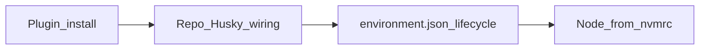

# Fold Cloud environment.json + Node into plugin bootstrap

## Recommended execution authority

| Slice                | Recommended authority | Agent instruction                                      |
| -------------------- | --------------------- | ------------------------------------------------------ |
| plan-review          | Plan-only PR          | Do not implement. Stop after opening the plan-only PR. |
| cloud-env-bootstrap  | Open PR only          | Do not merge. Stop after opening the PR.               |
| plan-closure         | Open PR only          | Do not merge. Stop after opening the PR.               |

Repo default: **Open PR only** (see team skill `/planning-methodology`).

## Repository topology

Multi-slice plans stack execution order, not Git branches. Integration branch is `main`.

**Before implementation:** start from latest `origin/main`.

**Before opening the PR:** branch represents only this slice — prior-slice work is on the integration branch, not via branch ancestry.

**After opening the PR:** GitHub PR base is `main`; diff excludes prior-slice work except through merged `main`.

---

## Plan review

**Recommended authority:** Plan-only PR

**Rationale:**

- Capture the three-layer Cloud readiness gap (capability → Husky wiring → environment lifecycle + Node) before editing skills/scripts
- Expected diff is plan artifact only

**Agent instruction:** Do not implement. Stop after opening the plan-only PR.

---

## Slice — cloud-env-bootstrap

**Recommended authority:** Open PR only

**Rationale:**

- One coherent plugin change: portable Cloud Node scripts + skill/README updates + version bump
- Merge-safe without consumer-repo PRs

**Agent instruction:** Do not merge. Stop after opening the PR.

**Goal:** New-repo / Cloud-hooks bootstrap treats committed `.cursor/environment.json` and (when needed) Node-from-`.nvmrc` as part of Cloud-Agent readiness, not a deferred first-Cloud-use chore.

**Prerequisite:** `plan-review` merged (or plan reviewed).

### Verdict / context

Yes. [resumes#84](https://github.com/mastermichaelt/resumes/pull/84) is a plugin-flow gap, not a resumes quirk. The post-#84 Build also showed a second gap: **site engines want Node 24 while the Cloud VM ships Node 22.x** (warn-only today; install still exited 0). Codenames already solved that with Build install + session PATH ([#518](https://github.com/multipliers-dev/codenames-ai-guesser/pull/518) / [#519](https://github.com/multipliers-dev/codenames-ai-guesser/pull/519)); the plugin never shipped it for new repos.

PR #80 copied portable Husky scripts and wired `prepare` + `sessionStart`. Cloud Agents still skipped the lifecycle without committed [`.cursor/environment.json`](https://github.com/mastermichaelt/resumes/blob/main/.cursor/environment.json): stale snapshot → no `npm ci` → no `prepare` → no Husky bridge. #84 added `install` + `start`. That is necessary but not sufficient when `.nvmrc` / `engines` require a newer Node than the VM.

The plugin currently documents layers 1–2 and **defers** layer 3:

- [`/cloud-hooks-bootstrap`](../../plugins/team-harness/skills/cloud-hooks-bootstrap/SKILL.md) stops at copy scripts, wire `prepare`, add `sessionStart`, verify a Cloud commit.
- [`/new-repo-bootstrap`](../../plugins/team-harness/skills/new-repo-bootstrap/SKILL.md) item 6: add `environment.json` “the first time you use Cloud Agents … after a successful Build.”

That deferral caused the extra step. Node pinning was never in the recipe at all.



| Layer | What it does | Where it lives |
| --- | --- | --- |
| 1. Plugin install | Distributes capability (Husky scripts + Node Cloud scripts + recipes) | Marketplace Default On |
| 2. Repo bootstrap | Wires `prepare`, `ensure-hooks`, `sessionStart` | One-time in-repo copy |
| 3. Cloud lifecycle | Guarantees Cloud **runs** wiring (`install` → Node pin + deps + `prepare`; `start` → session PATH + ensure-hooks rechain) | Committed `.cursor/environment.json` + copied Cloud Node scripts |

### Policy to encode

**When Cloud Agents are expected**, treat `environment.json` **and** (when `.nvmrc` / `engines` need it) Node-from-`.nvmrc` as part of the same Cloud-safe path — not a later “first Cloud use” chore.

**Do not** add `plugins/team-harness/templates/environment.json`. The dependency `install` command is repo-specific. A copyable JSON file would become cargo-cult. The skill holds a **recipe**; the bootstrap agent infers install details from the repo.

**Do** ship portable Cloud Node scripts (simplified from codenames), because the Node/PATH problem is shared: Build disk state does not export `PATH` into later agent shells; `/usr/local/bin` must be prepended again at `start` / terminals. Do not rewrite `/usr/bin/node` or Cursor `exec-daemon` binaries.

### Conceptual `environment.json` shapes

**Minimal (Node already matches VM / no `.nvmrc` pin needed):**

```json
{
  "name": "<repo>",
  "install": "<repo's deterministic dependency install>",
  "start": "sh scripts/ensure-hooks.sh"
}
```

**When `.nvmrc` (or engines) requires a newer major than the Cloud base image** — preferred default for Node repos that pin 24:

```json
{
  "name": "<repo>",
  "install": "sh scripts/cloud-agent-install.sh",
  "start": "sh scripts/cloud-agent-start.sh"
}
```

- `cloud-agent-install.sh`: if PATH Node major ≠ `.nvmrc` major, install latest `v${major}.x` into `/usr/local`; persist session PATH snippets (`profile.d` + shell rc); then run the **inferred** dependency install (must trigger `prepare`).
- `cloud-agent-start.sh`: source session PATH prepend; write a small Node probe log; run repo-local `ensure-hooks.sh`.
- `cloud-agent-session-path.sh`: prepend `/usr/local/bin` on `PATH` (idempotent); sourced by install persist, start, and any long-lived terminals the product adds later.
- Product extras (dev terminals, ports — see [codenames `environment.json`](https://github.com/multipliers-dev/codenames-ai-guesser/blob/main/.cursor/environment.json)) stay **out** of this primitive; products may layer them on after bootstrap.
- After merge, a human still needs a **new environment Build** (and promote it) so Cloud stops reusing the old snapshot. Document that; the plugin cannot automate it.

### Deliverables

Same-repo, merge-safe change in `cursor-team-marketplace` only.

#### New portable scripts under [`plugins/team-harness/scripts/`](../../plugins/team-harness/scripts/)

Generalize codenames (strip product-specific marker names / terminals / `npm ci` hardcode):

| Script | Role |
| --- | --- |
| `cloud-agent-session-path.sh` | Prepend `/usr/local/bin`; safe to source repeatedly |
| `cloud-agent-install.sh` | Node-from-`.nvmrc` major → `/usr/local`; persist PATH; then run deps install via env/arg or a small convention (e.g. `CLOUD_AGENT_INSTALL_CMD` defaulting to inferred `npm ci` / documented command) |
| `cloud-agent-start.sh` | Session PATH + Node probe log + `sh scripts/ensure-hooks.sh` |

Keep markers generic (`team-harness-cloud-node-path`, not `codenames-…`). Document: do not rewrite Cursor-owned node binaries.

[`scripts/check.sh`](../../scripts/check.sh) must `sh -n` these new scripts.

#### [`plugins/team-harness/skills/cloud-hooks-bootstrap/SKILL.md`](../../plugins/team-harness/skills/cloud-hooks-bootstrap/SKILL.md)

- Add the three-layer model (capability vs wiring vs lifecycle), including Node pin when required.
- Extend checklist when Cloud Agents are expected:
  1. Existing Husky script copy / `prepare` / `sessionStart`.
  2. Commit minimal `environment.json`.
  3. If `.nvmrc` / `engines` need a newer Node than typical Cloud VMs: also copy the three Cloud Node scripts; set `install`/`start` to those wrappers; configure the install script’s dependency command from this repo’s CI/lockfile (do not copy another product’s install line).
  4. If Node already matches: `install` = inferred deps only; `start` = `ensure-hooks.sh`.
- Agent behavior: generate JSON + choose Node wrapper from this repo’s story; do not cargo-cult codenames terminals/ports; do not skip `environment.json` if Cloud Agents are in scope.
- Call out post-merge: trigger/promote a new environment Build.

#### [`plugins/team-harness/skills/new-repo-bootstrap/SKILL.md`](../../plugins/team-harness/skills/new-repo-bootstrap/SKILL.md)

- Replace item 6’s “first Cloud Agent use after a successful Build” with: **if Cloud Agents are expected, establish `environment.json` (and Node-from-`.nvmrc` wrappers when engines/`.nvmrc` require it) during bootstrap, alongside `/cloud-hooks-bootstrap` Husky wiring.**
- Point at `/cloud-hooks-bootstrap` for the recipe; no second full JSON blob.
- Skip Cloud env only when Cloud Agents are **not** expected (same spirit as leaving `ai-learning` unharnessed).

#### Thin README pointers

- [`plugins/team-harness/README.md`](../../plugins/team-harness/README.md) and root [`README.md`](../../README.md): Cloud-hooks is still not Default-On-safe; when Cloud Agents are expected, wiring includes `environment.json` lifecycle and, when needed, Node-from-`.nvmrc` Build/session PATH (not only `prepare`).

#### Version

Bump [`plugins/team-harness/.cursor-plugin/plugin.json`](../../plugins/team-harness/.cursor-plugin/plugin.json) `1.3.0` → `1.4.0` (`preserve-plan-diagrams` already shipped on `main` as `1.3.0`).

### Out of scope

- No `templates/environment.json` (or any copyable JSON file).
- No consumer-repo PRs in this plan (`portfolio` / resumes Node pin are follow-ons once the primitive exists).
- No product terminals/ports recipe (codenames-specific); products add those after bootstrap if needed.
- No Team Rules paste; no claim that Default On writes `environment.json` or installs Node.

### Acceptance / verification

- `sh scripts/check.sh` (frontmatter + JSON + `sh -n` on all plugin scripts including new Cloud Node scripts).
- Skills state the three-layer path, inferred-install recipe, and when to use Node wrappers; new-repo-bootstrap no longer defers env config to first Cloud use.
- No committed sample `environment.json` under the plugin.
- Portable install script does not hardcode a single product’s monorepo `npm ci && npm ci --prefix site` — dependency command is parameterized / inferred at wire time.

---

## Plan closure (docs-only PR)

**Recommended authority:** Open PR only

**Rationale:**

- Docs-only archival; human review of closure checklist

**Agent instruction:** Do not merge. Stop after opening the PR.

After the last implementation slice merges:

1. Verify implementation todos are `completed` or `cancelled`
2. Add `# Shipped` with date, PR links, deferred work
3. Move to `.cursor/plans/archive/2026-08-26-cloud-env-bootstrap.plan.md`
4. Mark `plan-closure` completed; update references

---

## Agent prompts (copy/paste for Cursor)

Use a **fresh Agent-mode chat** per slice. Each default frontmatter todo has exactly one `### <todo-id>` heading copied from that todo’s `id` — do not rename ids to match prose.

### plan-review

```text
@.cursor/plans/2026-08-26-cloud-env-bootstrap.plan.md

Execute only plan-review. Do not start implementation slices.

Authority: Plan-only PR — commit the plan artifact only; do not implement. Stop after opening the plan-only PR.

Topology: start from latest origin/main; branch represents only the plan artifact; PR base must be main.

Deliverables: plan file under .cursor/plans/; mark plan-review completed in frontmatter in the same PR.

Verification: plan satisfies /planning-methodology; mermaid three-layer diagram and Node recipe preserved in the executing slice; no skill, script, or plugin.json changes included.
```

### cloud-env-bootstrap

```text
@.cursor/plans/2026-08-26-cloud-env-bootstrap.plan.md

Implement slice cloud-env-bootstrap only. Prerequisite: plan-review merged. Do not start plan-closure. Do not archive the plan.

Authority: Open PR only — implement and open the PR; do not merge.

Topology: start from latest origin/main; branch represents only this slice; PR base must be main.

Deliverables: portable cloud-agent-session-path.sh / cloud-agent-install.sh / cloud-agent-start.sh under plugins/team-harness/scripts/; update cloud-hooks-bootstrap + new-repo-bootstrap skills and README pointers; bump plugin.json 1.3.0 → 1.4.0; no templates/environment.json; no consumer-repo PRs. Mark cloud-env-bootstrap completed in plan frontmatter in this PR.

Verification: sh scripts/check.sh; skills no longer defer environment.json to first Cloud use; install script dependency command is parameterized (not hardcoded to resumes site npm ci).
```

### plan-closure

```text
@.cursor/plans/2026-08-26-cloud-env-bootstrap.plan.md

Execute only plan-closure.

Authority: Open PR only — docs-only archive PR; do not merge.

Prerequisites: implementation PRs actually merged to main (not merely frontmatter completed).

Topology: start from latest origin/main; branch represents only this slice; PR base must be main.

Deliverables: verify slice todos, add # Shipped note, move plan to .cursor/plans/archive/2026-08-26-cloud-env-bootstrap.plan.md, mark plan-closure completed, update agent prompt references to the archived path.

Verification: confirm all prerequisite implementation PRs are merged and slice todos are completed before archiving.
```
