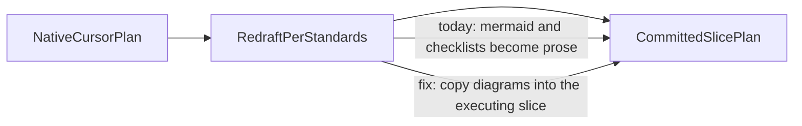

# Preserve diagrams when converting native plans

## Recommended execution authority

| Slice                   | Recommended authority | Agent instruction                                      |
| ----------------------- | --------------------- | ------------------------------------------------------ |
| plan-review             | Plan-only PR          | Do not implement. Stop after opening the plan-only PR. |
| preserve-plan-diagrams  | Open PR only          | Do not merge. Stop after opening the PR.               |
| plan-closure            | Open PR only          | Do not merge. Stop after opening the PR.               |

Repo default: **Open PR only** (see team skill `/planning-methodology`).

## Repository topology

Multi-slice plans stack execution order, not Git branches. Integration branch is `main`.

**Before implementation:** start from latest `origin/main`.

**Before opening the PR:** branch represents only this slice — prior-slice work is on the integration branch, not via branch ancestry.

**After opening the PR:** GitHub PR base is `main`; diff excludes prior-slice work except through merged `main`.

---

## Plan review

**Recommended authority:** Plan-only PR

**Rationale:**

- Capture the conversion-loss problem and the wrap-and-slice rule before editing the skill
- Expected diff is plan artifact only

**Agent instruction:** Do not implement. Stop after opening the plan-only PR.

---

## Slice — preserve-plan-diagrams

**Recommended authority:** Open PR only

**Rationale:**

- One coherent skill change (SKILL + reference + template comment + version bump)
- Merge-safe without consumer-repo `planning-standards.md` edits

**Agent instruction:** Do not merge. Stop after opening the PR.

**Goal:** Make “redraft / align with planning standards” mean wrap-and-slice, not strip mermaid and other implementation-critical structure.

**Prerequisite:** `plan-review` merged (or plan reviewed).

### Policy to encode (canonical in the skill)

Add a **Native plan conversion** item under [Staged plan authoring](../../plugins/team-harness/skills/planning-methodology/SKILL.md) (new item after the existing 0–8 list). Keep it short; the skill stays the procedure, not a second copy of Team Rules.

**Wrap and slice; do not strip.**

- Add the required envelope: frontmatter todos, authority table, topology, per-slice blocks, agent prompts, `plan-closure`.
- Preserve from the source: mermaid/markdown diagrams, and tables/checklists that encode the work (phased strategies, verification lists, capability models).
- Put those artifacts in the **slice that will execute them**, or in a `## Design` / `## Context` section that implementation slices are required to follow — not only as a compressed appendix.
- A one-line summary may accompany a diagram; it must **not** replace it.
- “Redraft / align with this methodology” means add the envelope. It does **not** mean delete design artifacts to match the boilerplate skeleton.
- A pointer to `~/.cursor/plans/` is not enough — those files are local and not reviewable in the PR.

Plan-review / conversion verification must include: source diagrams and implementation-critical structure preserved.



**Anti-pattern (for [reference.md](../../plugins/team-harness/skills/planning-methodology/reference.md)):** replacing the four-layer mermaid with “four capability layers (day-job vs interview-format vs …)”.

### Files to change (this repo only)

- [`plugins/team-harness/skills/planning-methodology/SKILL.md`](../../plugins/team-harness/skills/planning-methodology/SKILL.md) — new conversion item; plan-review / conversion verification includes “source diagrams and implementation-critical structure preserved.”
- [`plugins/team-harness/skills/planning-methodology/reference.md`](../../plugins/team-harness/skills/planning-methodology/reference.md) — short author guidance + anti-pattern.
- [`plugins/team-harness/skills/planning-methodology/_template.plan.md`](../../plugins/team-harness/skills/planning-methodology/_template.plan.md) — one comment under a slice: if converting from a native plan, paste mermaid/diagrams into the slice that needs them (do not invent a dummy diagram in the boilerplate).
- [`plugins/team-harness/.cursor-plugin/plugin.json`](../../plugins/team-harness/.cursor-plugin/plugin.json) — bump `1.2.0` → `1.3.0`.

Do **not** duplicate this into in-repo `planning-standards.md` copies (resumes / portfolio / codenames). Team Rules already point agents at `/planning-methodology` for staged-plan procedure.

**Acceptance:**

- [ ] SKILL.md has a Native plan conversion item: wrap-and-slice, preserve mermaid/tables/checklists, no `~/.cursor/plans/` pointer substitute
- [ ] reference.md documents the four-layer mermaid → prose anti-pattern
- [ ] `_template.plan.md` comments that converters should paste source diagrams into the executing slice
- [ ] `plugin.json` is `1.3.0`
- [ ] `sh scripts/check.sh` passes

**Out of scope:** restoring mermaid/tables in `resumes/.cursor/plans/2026-08-26-relevance-aipe-interview-retrospective.plan.md`; Team Rules; CreatePlan UI table-vs-mermaid constraints.

---

## Plan closure (docs-only PR)

**Recommended authority:** Open PR only

**Rationale:**

- Docs-only archival after implementation merges

**Agent instruction:** Do not merge. Stop after opening the PR.

After `preserve-plan-diagrams` merges:

1. Verify implementation PRs are actually merged to `main` (not merely frontmatter `completed`)
2. Verify remaining todos are `completed` or `cancelled`
3. Add `# Shipped` with date, PR links, deferred work
4. Move this file to `.cursor/plans/archive/2026-08-26-preserve-plan-diagrams.plan.md`
5. Mark `plan-closure` completed; update agent prompt references to the archived path
6. No production behavior changes

---

## Context (plan review reference)

Implementation slices must follow the policy and mermaid in **Slice — preserve-plan-diagrams**. This section is evidence, not a substitute for those artifacts.

### What went wrong

The marketplace skill tells agents how to **slice** a plan (frontmatter, authority, topology, copy/paste prompts). It never says what to **keep** from a Cursor-native plan (`~/.cursor/plans/*.plan.md`) when rewriting it into a committed [`.cursor/plans/*.plan.md`](../../plugins/team-harness/skills/planning-methodology/_template.plan.md).

Plan-review prompts then say “redraft / align with planning standards.” Agents treat that as “make it look like the slice template,” and compress design content into prose.

### Evidence (Relevance conversion)

- **Kept:** slice envelope, authority table, agent prompts, some context tables.
- **Dropped:** the mermaid four-capability-layers flowchart.
- **Also compressed (same failure mode):** timed-build phase table and the agentic verification checklist — both became one-line summaries in the slice body.

Older committed plans (e.g. `resumes/.cursor/plans/archive/2026-08-11-relevance-aipe-tao-screen-debrief.plan.md`) did keep mermaid inside the slice. The template already allows it; the skill just never required it.

---

## Agent prompts (copy/paste for Cursor)

Use a **fresh Agent-mode chat** per slice. Each default frontmatter todo has exactly one `### <todo-id>` heading copied from that todo’s `id` — do not rename ids to match prose.

### plan-review

```text
@.cursor/plans/2026-08-26-preserve-plan-diagrams.plan.md

Execute only plan-review. Do not start implementation slices.

Authority: Plan-only PR — commit the plan artifact only; do not implement. Stop after opening the plan-only PR.

Topology: start from latest origin/main; branch represents only the plan artifact; PR base must be main.

Deliverables: plan file under .cursor/plans/; mark plan-review completed in frontmatter in the same PR.

Verification: plan satisfies /planning-methodology; source mermaid and conversion policy preserved in the executing slice (not prose-only); no skill or plugin.json changes included.
```

### preserve-plan-diagrams

```text
@.cursor/plans/2026-08-26-preserve-plan-diagrams.plan.md

Implement slice preserve-plan-diagrams only. Prerequisite: plan-review merged. Do not start plan-closure. Do not archive the plan.

Authority: Open PR only — implement and open the PR; do not merge.

Topology: start from latest origin/main; branch represents only this slice; PR base must be main.

Deliverables: Native plan conversion item in planning-methodology SKILL.md; reference.md anti-pattern; _template.plan.md slice comment; plugin.json 1.3.0. Mark preserve-plan-diagrams completed in plan frontmatter in this PR.

Verification: sh scripts/check.sh; skill explicitly requires source mermaid/implementation-critical structure to survive native-plan conversion; do not reproduce this plan's example diagram in the skill; no consumer-repo planning-standards.md edits.
```

### plan-closure

```text
@.cursor/plans/2026-08-26-preserve-plan-diagrams.plan.md

Execute only plan-closure.

Authority: Open PR only — docs-only archive PR; do not merge.

Prerequisites: implementation PRs actually merged to main (not merely frontmatter completed).

Topology: start from latest origin/main; branch represents only this slice; PR base must be main.

Deliverables: verify slice todos, add # Shipped note, move plan to .cursor/plans/archive/2026-08-26-preserve-plan-diagrams.plan.md, mark plan-closure completed, update agent prompt references to the archived path.

Verification: confirm all prerequisite implementation PRs are merged and slice todos are completed before archiving.
```
