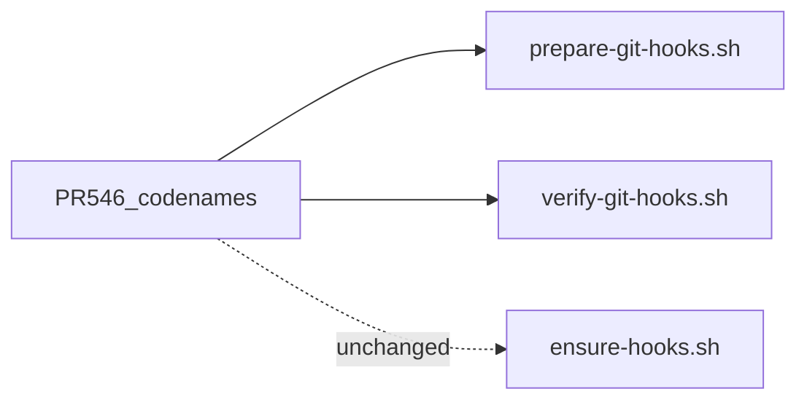

# Marketplace account for PR #546 worktree hooks fix

## Verdict

**Yes, for the portable prepare path. No, for the Cloud agent-hooks bridge.**

[PR #546](https://github.com/multipliers-dev/codenames-ai-guesser/pull/546) fixes a **general Husky + `git worktree`** failure mode:

- Fresh worktrees inherit `core.hooksPath=.husky/_`
- They do **not** get `.husky/_` until Husky runs in that worktree
- Commits then skip hooks silently

That is orthogonal to Cursor Cloud’s `agent-hooks` dispatcher. [#546](https://github.com/multipliers-dev/codenames-ai-guesser/pull/546) did **not** change [`ensure-hooks.sh`](plugins/team-harness/scripts/ensure-hooks.sh) or [`session-ensure-git-hooks.sh`](plugins/team-harness/scripts/session-ensure-git-hooks.sh).

Marketplace [`prepare-git-hooks.sh`](plugins/team-harness/scripts/prepare-git-hooks.sh) is still the **pre-fix** copy. Codenames `main` now has the fixed prepare + new `verify-git-hooks.sh`. New `/cloud-hooks-bootstrap` and `/interview-repo-bootstrap` installs would keep shipping the silent-skip bug until marketplace catches up.



## Recommended execution authority

| Slice | Recommended authority | Agent instruction |
| --- | --- | --- |
| plan-review | Plan-only PR | Do not implement. Stop after opening the plan-only PR. |
| worktree-hooks-backport | Open PR only | Do not merge. Stop after opening the PR. |
| plan-closure | Open PR only | Do not merge. Stop after opening the PR. |

Repo default: **Open PR only** (see team skill `/planning-methodology`).

## Repository topology (default)

Multi-slice plans stack execution order, not Git branches. Integration branch is `main` unless a slice explicitly authorizes otherwise.

**Before implementation:** start from latest `origin/main`.

**Before opening the PR:** branch represents only this slice — prior-slice work is on the integration branch, not via branch ancestry.

**After opening the PR:** GitHub PR base is `main`; diff excludes prior-slice work except through merged `main`.

---

## Plan review (plan-only)

**Recommended authority:** Plan-only PR

**Rationale:**

- Agree on backport scope and the stronger “hook executed” acceptance criterion before changing portable scripts
- Expected diff is plan artifact only

**Agent instruction:** Do not implement. Stop after opening the plan-only PR.

**Status:** Completed in this PR.

---

## Slice — worktree-hooks-backport

**Recommended authority:** Open PR only

**Rationale:**

- Touches portable hook install scripts and contributor/bootstrap docs; silent-skip failure mode needs human review
- Automated worktree commit smoke must assert execution, not only shim shape

**Agent instruction:** Do not merge. Stop after opening the PR.

**Goal:** Marketplace Cloud-hooks prepare path matches codenames #546; fresh-worktree-shaped state gets working hooks; CI proves pre-commit **executed**.

**Deliverables (single PR):**

1. **Update** [`plugins/team-harness/scripts/prepare-git-hooks.sh`](plugins/team-harness/scripts/prepare-git-hooks.sh) to match codenames `origin/main` behavior (keep marketplace header comments about Default On / portable primitive):
   - `should_install_husky` / `install_husky` + `HUSKY_INSTALLED`
   - Re-run husky when `.husky/pre-commit` exists but `.husky/_/pre-commit` is missing
   - Call verify after a successful install

2. **Add** [`plugins/team-harness/scripts/verify-git-hooks.sh`](plugins/team-harness/scripts/verify-git-hooks.sh) (same as codenames).

3. **Interview preset**
   - Extend allowlist in [`interview-repo-bootstrap.sh`](plugins/team-harness/scripts/interview-repo-bootstrap.sh) to also copy `verify-git-hooks.sh`
   - Add `"verify:git-hooks": "sh scripts/verify-git-hooks.sh"` to [`templates/interview-repo/package.json`](plugins/team-harness/templates/interview-repo/package.json)
   - Update skill allowlist tables that say “only these three”

4. **Docs / skill**
   - [`cloud-hooks-bootstrap/SKILL.md`](plugins/team-harness/skills/cloud-hooks-bootstrap/SKILL.md): list `verify-git-hooks.sh`; note after `git worktree add` run `npm run prepare` (or `verify:git-hooks`) before committing; when re-wiring existing repos, re-copy prepare + add verify
   - Short mention in plugin/root README script tables
   - Bump [`plugin.json`](plugins/team-harness/.cursor-plugin/plugin.json) **1.5.0 → 1.6.0**

5. **Tests (required acceptance = hook executed)** — same invariant as [#546](https://github.com/multipliers-dev/codenames-ai-guesser/pull/546): filesystem shape alone is insufficient.

### Acceptance criterion (merge-blocking)

After prepare in a **fresh-worktree-shaped** state (`core.hooksPath=.husky/_`, `.husky/_` missing, `.husky/pre-commit` present):

1. Run the portable prepare path.
2. Perform a throwaway `git commit`.
3. Assert the **expected pre-commit actually executed** via a probe side effect (marker file and/or sentinel in commit output) — **not** merely that `.husky/_/pre-commit` exists or `hooksPath` is set.

Layout checks (`verify` fails without shim; shim appears after prepare) may exist as supporting cases; they do **not** satisfy acceptance by themselves.

### How (concrete)

Full real-worktree smoke is cheap enough here and is **required**, not optional:

- Marketplace already uses shell runtime smokes wired in [`scripts/check.sh`](scripts/check.sh) (`test-cloud-agent-install-runtime.sh`, `test-interview-repo-bootstrap-runtime.sh`) and interview bootstrap already asserts commit → sentinel ([`run_git_commit_smoke`](plugins/team-harness/scripts/interview-repo-bootstrap.sh)).
- Add [`scripts/test-prepare-git-hooks-worktree-runtime.sh`](scripts/test-prepare-git-hooks-worktree-runtime.sh) (name flexible) that:
  - Builds a minimal temp git repo (or `git worktree add` fixture) with husky available
  - Reproduces the broken state (remove `.husky/_`, keep/set `hooksPath=.husky/_`)
  - Runs plugin `prepare-git-hooks.sh`
  - Swaps/probes `.husky/pre-commit` to write a marker (or assert sentinel)
  - Commits and asserts the marker/sentinel — fail if commit succeeds without hook execution
  - Cleans up worktree/temp repo
- Wire the script into [`scripts/check.sh`](scripts/check.sh) next to the other runtime smokes so CI enforces it permanently.

Port the probe pattern from codenames `scripts/cloud-agent-hooks.test.ts` “fresh worktree hooks smoke”; prefer shell to match marketplace harness style.

**Verification:**

- Runtime worktree smoke green via `scripts/check.sh`
- Supporting layout checks optional but not sufficient alone
- PR base is `main`; branch carries only this slice

---

## Plan closure (docs-only PR)

**Recommended authority:** Open PR only

**Rationale:**

- Docs-only archival; human review of closure checklist

**Agent instruction:** Do not merge. Stop after opening the PR.

After the last implementation slice merges:

1. Verify `worktree-hooks-backport` is actually **merged** to `main` — do not trust frontmatter alone
2. Verify remaining todos are `completed` or `cancelled`
3. Add `# Shipped` closure note at the top of the plan body
4. Move this file to `.cursor/plans/archive/2026-08-26-worktree-hooks-backport.plan.md`
5. Mark `plan-closure` `completed` and update agent prompt references to the archived path

Do not archive inside the implementation PR.

---

## Explicit non-goals

- Do **not** change `ensure-hooks.sh` / sessionStart for this fix
- Do **not** require retrofitting `portfolio` / `resumes` in the same PR (already-wired copies; optional follow-up when those repos next touch hooks)
- Do **not** re-implement in marketplace — port from codenames `main` (`e8b2691` lineage)
- Do **not** treat “shim exists” / “verify exits 0” as sufficient merge criteria for the implementation slice

---

## Agent prompts (copy/paste for Cursor)

Use a **fresh Agent-mode chat** per slice. Each default frontmatter todo has exactly one `### <todo-id>` heading copied from that todo’s `id`.

### plan-review

```text
@.cursor/plans/2026-08-26-worktree-hooks-backport.plan.md

Execute only plan-review. Do not start worktree-hooks-backport or plan-closure.

Authority: Plan-only PR — commit the plan artifact only; do not implement. Stop after opening the plan-only PR.

Topology: start from latest origin/main; branch represents only the plan artifact; PR base must be main.

Deliverables: plan file under .cursor/plans/; mark plan-review completed in frontmatter in the same PR.

Verification: plan satisfies planning-methodology (authority table, topology, plan-closure, agent prompts); stronger acceptance criterion (fresh-worktree-shaped commit + hook execution) is explicit; no implementation changes included.
```

### worktree-hooks-backport

```text
@.cursor/plans/2026-08-26-worktree-hooks-backport.plan.md

Implement slice worktree-hooks-backport only. Prerequisite: plan-review merged. Do not start plan-closure. Do not archive the plan.

Authority: Open PR only — implement and open the PR; do not merge.

Topology: start from latest origin/main; branch represents only this slice; PR base must be main.

Deliverables: port prepare-git-hooks.sh worktree logic + verify-git-hooks.sh; interview allowlist + verify:git-hooks script; cloud-hooks skill/README; plugin.json 1.6.0; required scripts/test-prepare-git-hooks-worktree-runtime.sh wired into check.sh that asserts pre-commit executed (probe/sentinel), not merely shim exists. Mark worktree-hooks-backport completed in plan frontmatter in this PR.

Verification: check.sh green including worktree commit+execution smoke; no ensure-hooks/sessionStart changes; no portfolio/resumes retrofit.
```

### plan-closure

```text
@.cursor/plans/2026-08-26-worktree-hooks-backport.plan.md

Execute only plan-closure.

Authority: Open PR only — docs-only archive PR; do not merge.

Prerequisites: worktree-hooks-backport actually merged to main and already marked completed in frontmatter.

Topology: start from latest origin/main; branch represents only this slice; PR base must be main.

Deliverables: verify slice todos, add # Shipped note, move plan to .cursor/plans/archive/2026-08-26-worktree-hooks-backport.plan.md, mark plan-closure completed, update agent prompt references to the archived path.

Verification: confirm the prerequisite implementation PR is merged and slice todos are completed before archiving.
```
