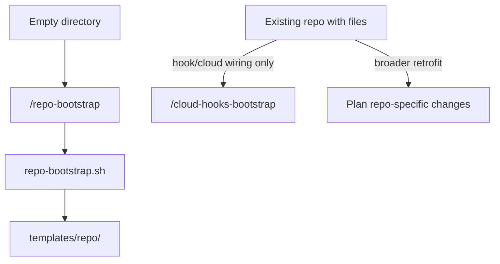

# Unify repo bootstrap on interview baseline

## Recommended execution authority

| Slice | Recommended authority | Agent instruction |
| --- | --- | --- |
| plan-review | Plan-only PR | Do not implement. Stop after opening the plan-only PR. |
| repo-bootstrap | Open PR only | Do not merge. Stop after opening the PR. |
| plan-closure | Open PR only | Do not merge. Stop after opening the PR. |

Repo default: **Open PR only** (see team skill `/planning-methodology`).

## Repository topology

Multi-slice plans stack execution order, not Git branches. Integration branch is `main`.

**Before implementation:** start from latest `origin/main`.

**Before opening the PR:** branch represents only this slice — prior-slice work is on the integration branch, not via branch ancestry.

**After opening the PR:** GitHub PR base is `main`; diff excludes prior-slice work except through merged `main`.

---

## Problem

Two skills cover overlapping ground with different ergonomics:

| Skill | Style | Target |
| --- | --- | --- |
| [`new-repo-bootstrap`](../../plugins/team-harness/skills/new-repo-bootstrap/SKILL.md) | Abstract 8-item checklist (User Rules, PR template, Bugbot, etc.) | Production greenfield |
| [`interview-repo-bootstrap`](../../plugins/team-harness/skills/interview-repo-bootstrap/SKILL.md) | Concrete script + template + hook smoke | Empty directory only |

Running the abstract one yields a checklist instead of the script-driven flow. Goal: **one skill**, **interview-style concreteness**, **empty-directory only**.

## Target architecture



- **`/repo-bootstrap`** — run `repo-bootstrap.sh` from the installed **team-harness** plugin; stop on success. **Only** for actually-empty directories.
- **Existing repos** — out of scope for `/repo-bootstrap`. Use `/cloud-hooks-bootstrap` when the missing piece is specifically hook/cloud wiring; otherwise plan repo-specific changes explicitly. Do not treat `/cloud-hooks-bootstrap` as a generic migration path.
- **Remove** `/new-repo-bootstrap` and `/interview-repo-bootstrap` entirely (no aliases).

---

## Slice — repo-bootstrap

**Recommended authority:** Open PR only

**Rationale:**

- Single merge-safe slice: renames, skill consolidation, docs, and verification guard ship together
- Breaking invoke-path change requires coordinated rename across skills, scripts, templates, and check.sh

**Agent instruction:** Do not merge. Stop after opening the PR.

**Goal:** One concrete `/repo-bootstrap` skill; delete abstract `/new-repo-bootstrap` and interview-specific invoke path.

### Rename map

| Current | New |
| --- | --- |
| `skills/interview-repo-bootstrap/` | `skills/repo-bootstrap/` |
| `scripts/interview-repo-bootstrap.sh` | `scripts/repo-bootstrap.sh` |
| `templates/interview-repo/` | `templates/repo/` |
| `scripts/test-interview-repo-bootstrap-runtime.sh` | `scripts/test-repo-bootstrap-runtime.sh` |
| Sentinel `[interview-bootstrap]` | `[repo-bootstrap]` |

Frontmatter `name:` must match directory name (`repo-bootstrap`) per [`scripts/check.sh`](../../scripts/check.sh) validation.

### Skill content ([`skills/repo-bootstrap/SKILL.md`](../../plugins/team-harness/skills/repo-bootstrap/SKILL.md))

Start from the current interview skill and adjust:

1. **Description** — bootstrap an actually-empty directory into a pre-wired repo (TypeScript + tsx + Vitest + AGENTS.md + Husky + CI + GitHub remote). Drop “timed technical interview” as the primary framing; keep the five-layer model and scope test.
2. **Agent behavior** — same operational sequence: confirm empty dir → locate plugin → `--dry-run` when validating → run script → **stop**.
3. **Non-empty boundary** — use this wording (in skill body and agent behavior):

   > `/repo-bootstrap` only operates on actually-empty directories. Existing repos are out of scope; use `/cloud-hooks-bootstrap` when the needed retrofit is hook/cloud wiring, otherwise plan the repo-specific changes explicitly.

4. **Drop** the abstract checklist entirely (PR template skeleton, Bugbot, GitHub App, inherited-layers table from new-repo-bootstrap).
5. **Related skills** — `/cloud-hooks-bootstrap` (hook/cloud wiring into existing repos only; not a generic migration path) and `/planning-methodology` (if worth a one-liner).

**Delete:** [`plugins/team-harness/skills/new-repo-bootstrap/SKILL.md`](../../plugins/team-harness/skills/new-repo-bootstrap/SKILL.md) (and empty directory).

### Script and template tweaks

**[`repo-bootstrap.sh`](../../plugins/team-harness/scripts/repo-bootstrap.sh)** (renamed from interview script):

- Update usage text, comments, and `SENTINEL` constant.
- Point `TEMPLATE_DIR` at `templates/repo/`.
- Keep behavior identical: empty-dir guard, hook allowlist copy, `npm install`, hook smoke, initial commit, `gh repo create`.

**Template [`templates/repo/`](../../plugins/team-harness/templates/repo/)**:

- `.husky/pre-commit` — sentinel string.
- `AGENTS.md` — soften “Technical interview repo” to generic greenfield wording; keep commands/discipline unchanged.

No new preset capabilities (still no `.nvmrc`, PR template, Bugbot, lint-staged).

### Cross-reference and docs updates

| File | Change |
| --- | --- |
| [`plugins/team-harness/skills/cloud-hooks-bootstrap/SKILL.md`](../../plugins/team-harness/skills/cloud-hooks-bootstrap/SKILL.md) | Replace `/interview-repo-bootstrap` refs with `/repo-bootstrap` for empty-dir one-shot; clarify this skill is for hook/cloud wiring into existing repos — not a generic non-empty migration path |
| [`plugins/team-harness/README.md`](../../plugins/team-harness/README.md) | Single row for `repo-bootstrap`; remove new-repo and interview rows |
| [`README.md`](../../README.md) | Collapse two bootstrap rows into one `/repo-bootstrap` row |
| [`plugins/team-harness/.cursor-plugin/plugin.json`](../../plugins/team-harness/.cursor-plugin/plugin.json) | Description, keywords; bump **1.6.2 → 1.7.0** |
| [`.cursor-plugin/marketplace.json`](../../.cursor-plugin/marketplace.json) | Matching description/version bump |
| [`scripts/check.sh`](../../scripts/check.sh) | Assert `repo-bootstrap.sh`, `templates/repo/`, invoke renamed test script; add stale-reference guard |

**Leave archived plans untouched** — historical references to old skill names are fine.

### Verification

```bash
./scripts/check.sh
```

Covers: skill frontmatter, `sh -n` on all scripts, repo-bootstrap runtime smoke (dry-run, non-empty guard, invalid repo names, literal substitution).

#### Stale-reference guard (breaking rename)

Add an explicit check in [`scripts/check.sh`](../../scripts/check.sh) (or a small helper it invokes) that **live** docs/code contain **no** references to:

- `/new-repo-bootstrap`
- `/interview-repo-bootstrap`
- `interview-repo-bootstrap.sh`
- `templates/interview-repo/`
- `skills/new-repo-bootstrap/` or `skills/interview-repo-bootstrap/`
- frontmatter `name: new-repo-bootstrap` or `name: interview-repo-bootstrap`

**Allowed locations** (exclude from the scan):

- `.cursor/plans/archive/**` — archived plans keep historical names
- Git history / blame (not scanned; file contents only)

Suggested implementation: `rg` over the repo with `--glob '!**/.cursor/plans/archive/**'` for each pattern; fail if any match outside the allowlist.

Manual verification after implementation:

1. `--dry-run` in empty temp dir — no writes (required).
2. **Full bootstrap smoke** in empty temp dir — **required when CI/credentials permit** (`npm`, `gh` auth). Dry-run and `sh -n` alone will not catch failures in `npm install`, hook execution, initial commit, or `gh repo create`. Assert commit output contains `[repo-bootstrap] pre-commit verify`. If credentials are unavailable locally, run the same smoke in CI or document why it was skipped.

### Breaking change note

Invoke paths `/new-repo-bootstrap` and `/interview-repo-bootstrap` disappear. Users and docs should switch to `/repo-bootstrap`. No backward-compat skill aliases in this slice.

### Explicit non-goals

- Extending the script for non-empty directories.
- Re-adding PR template / Bugbot / domain-rules guidance from old new-repo-bootstrap.
- Changes to `/cloud-hooks-bootstrap` behavior or Cloud Node scripts.

---

## Plan closure (docs-only PR)

**Recommended authority:** Open PR only

**Rationale:**

- Docs-only archival; human review of closure checklist

**Agent instruction:** Do not merge. Stop after opening the PR.

After `repo-bootstrap` merges:

1. Verify slice todo `completed`
2. Add `# Shipped` closure note with date and PR links
3. Move to `.cursor/plans/archive/2026-08-28-unify-repo-bootstrap.plan.md`
4. Mark `plan-closure` completed; update agent prompt paths

---

## Agent prompts (copy/paste for Cursor)

Use a **fresh Agent-mode chat** per slice.

### plan-review

```text
@.cursor/plans/2026-08-28-unify-repo-bootstrap.plan.md

Execute only plan-review. Do not start implementation slices.

Authority: Plan-only PR — commit the plan artifact only; do not implement. Stop after opening the plan-only PR.

Topology: start from latest origin/main; branch represents only the plan artifact; PR base must be main.

Deliverables: plan file under .cursor/plans/; mark plan-review completed in frontmatter in the same PR.

Verification: plan satisfies planning-methodology envelope; no implementation changes included.
```

### repo-bootstrap

```text
@.cursor/plans/2026-08-28-unify-repo-bootstrap.plan.md

Implement slice repo-bootstrap only. Prerequisite: plan-review merged. Do not start plan-closure. Do not archive the plan.

Authority: Open PR only — implement and open the PR; do not merge.

Topology: start from latest origin/main; branch represents only this slice; PR base must be main.

Deliverables: rename skill/script/template/test to repo-bootstrap; delete new-repo-bootstrap skill; update cross-refs; add stale-reference guard in check.sh; bump plugin.json and marketplace.json to 1.7.0. Mark repo-bootstrap completed in plan frontmatter in this PR.

Verification: ./scripts/check.sh; stale-reference guard passes (no live refs to old invoke paths outside archived plans); dry-run in empty temp dir writes nothing; full bootstrap smoke in empty temp dir when CI/credentials permit (commit output must contain `[repo-bootstrap] pre-commit verify` — required because this slice is primarily a rename of a concrete runtime flow).
```

### plan-closure

```text
@.cursor/plans/2026-08-28-unify-repo-bootstrap.plan.md

Execute only plan-closure.

Authority: Open PR only — docs-only archive PR; do not merge.

Prerequisites: repo-bootstrap merged and marked completed in frontmatter.

Topology: start from latest origin/main; branch represents only this slice; PR base must be main.

Deliverables: verify slice todos, add # Shipped note, move plan to .cursor/plans/archive/2026-08-28-unify-repo-bootstrap.plan.md, mark plan-closure completed, update agent prompt references to archived path.

Verification: prerequisite implementation PR merged; slice todo completed before archiving.
```
