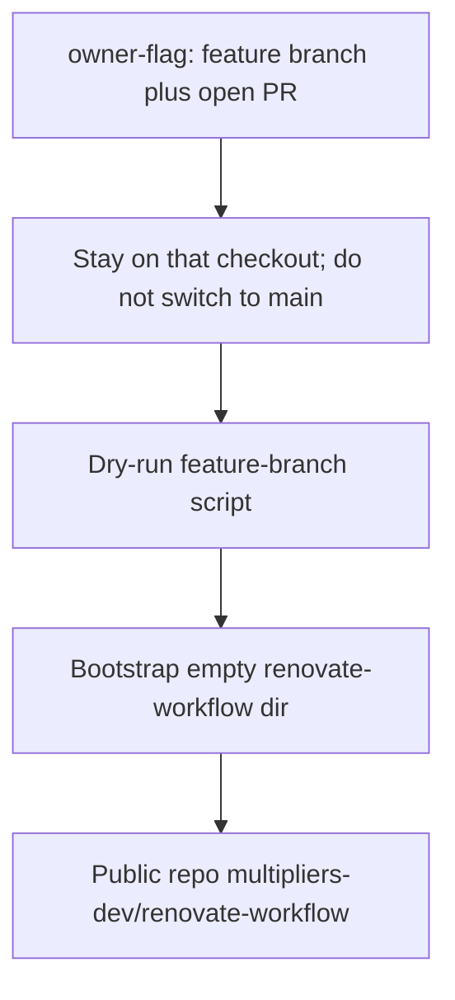

# Bootstrap renovate-workflow under multipliers-dev

Converted from the Cursor-native plan. Envelope added; design artifacts preserved.

## Recommended execution authority

| Slice | Recommended authority | Agent instruction |
| --- | --- | --- |
| plan-review | Plan-only PR | Do not implement. Stop after opening the plan-only PR. |
| owner-flag | Open PR only | Do not merge. Stop after opening the PR. Remain on that feature branch. |
| bootstrap-repo | Operational, then Open PR only for plan-status | Do not merge owner-flag. Do not wait for owner-flag merge. Do not check out `main` to invoke the script. After URL verify, open a plan-status PR from `origin/main`; do not merge. |
| plan-closure | Open PR only | Do not merge. Stop after opening the PR. |

Repo default: **Open PR only** (see team skill `/planning-methodology`).

## Repository topology

Multi-slice plans stack execution order, not Git branches. Integration branch is `main`.

**Before implementation:** start from latest `origin/main` (except `bootstrap-repo` script invocation — see [Explicit owner-flag → bootstrap-repo dependency](#explicit-owner-flag--bootstrap-repo-dependency)).

**Before opening the PR:** branch represents only this slice — prior-slice work is on the integration branch, not via branch ancestry.

**After opening the PR:** GitHub PR base is `main`; diff excludes prior-slice work except through merged `main`.

---

## Explicit owner-flag → bootstrap-repo dependency

`bootstrap-repo` **depends on unmerged `owner-flag` code**. That is intentional.

- `owner-flag` creates `--owner` on a **feature branch** and opens a PR. Do not merge.
- `bootstrap-repo` is **permitted** to invoke that **exact checked-out feature branch / worktree** copy of `repo-bootstrap.sh` purely to bootstrap `multipliers-dev/renovate-workflow`.
- After opening the `owner-flag` PR, **stay on that feature branch** (or, in a fresh chat, check out that same PR branch). Do not check out `main` again before invoking the script. Do not wait for merge. Do not use the installed/cached plugin copy.
- Do **not** claim that published team-harness supports org bootstrapping until the `owner-flag` PR merges **and** the plugin is republished. `bootstrap-repo` is a one-off use of the local implementation, not a statement that `/repo-bootstrap` in the installed plugin already has `--owner`.



---

## Preconditions (already checked at plan time)

- Target [`/Users/michaeltruong/code/renovate-workflow`](/Users/michaeltruong/code/renovate-workflow) has no tracked files (re-confirm with `ls -A` before writes; any entry including `.DS_Store` → stop).
- [`https://github.com/multipliers-dev/renovate-workflow`](https://github.com/multipliers-dev/renovate-workflow) does not exist.
- Marketplace source of truth after `owner-flag`: [`plugins/team-harness/scripts/repo-bootstrap.sh`](../../plugins/team-harness/scripts/repo-bootstrap.sh) on that feature branch.
- Visibility: **public**. Authenticated `gh` user at plan time: `mastermichaelt`.

---

## Slice — plan-review

**Recommended authority:** Plan-only PR

**Rationale:**

- Org-owner CLI plus an intentional unmerged-checkout bootstrap should land for review before script changes

**Agent instruction:** Do not implement. Stop after opening the plan-only PR.

**Goal:** Commit this plan artifact only.

---

## Slice — owner-flag

**Recommended authority:** Open PR only

**Rationale:**

- One merge-safe CLI concern: destination namespace as a separate field from repository identity
- Shared bootstrap tool; backward compatibility (omitted owner) ships in the same PR as the new flags

**Agent instruction:** Do not merge. Stop after opening the PR.

**Goal:** Add `--owner` / `--org` to repo-bootstrap. Remain on the feature branch after the PR opens so `bootstrap-repo` can use that checkout.

### Contract

Keep these fields separate — do not relax `--name` to accept `org/repo`:

- `owner` = destination namespace (`--owner`, with `--org` as a true alias)
- `name` = repository identity (bare `--name` only)

Validate each with `^[A-Za-z0-9._-]+$` (no slash). If owner is omitted, keep today’s behavior: `gh repo create "$REPO_NAME"` under the authenticated user.

When owner is set, construct the create target as `${owner}/${name}`:

```sh
gh repo create "$REPO_OWNER/$REPO_NAME" \
  --source=. --remote=origin --push --public
```

### What to update

Source of truth: [`plugins/team-harness/scripts/repo-bootstrap.sh`](../../plugins/team-harness/scripts/repo-bootstrap.sh).

- `usage()` and dry-run summary (show owner + constructed `owner/name`)
- [`plugins/team-harness/skills/repo-bootstrap/SKILL.md`](../../plugins/team-harness/skills/repo-bootstrap/SKILL.md) CLI docs
- [`scripts/test-repo-bootstrap-runtime.sh`](../../scripts/test-repo-bootstrap-runtime.sh) — four behaviors:

1. `--owner` constructs `owner/name`. Dry-run `--owner multipliers-dev --name renovate-workflow` shows create target `multipliers-dev/renovate-workflow`.
2. `--org` is a true alias and constructs the **same exact** create target. Dry-run `--org multipliers-dev --name renovate-workflow` must equal the `--owner` dry-run target (`multipliers-dev/renovate-workflow`), not merely “succeed.”
3. Invalid owner fails before writes.
4. Omitted owner preserves existing authenticated-user behavior (`gh repo create "$REPO_NAME"` with no owner prefix). `--name org/repo` remains rejected.

Run the marketplace check that already invokes that runtime script. Open the PR targeting `main`. Do not merge. Do not check out `main` afterward.

---

## Slice — bootstrap-repo

**Recommended authority:** Operational slice (not a marketplace implementation PR), then Open PR only for the plan-status PR

**Rationale:**

- Creating `multipliers-dev/renovate-workflow` is a one-shot bootstrap, not product code in this repo
- Script invocation is explicitly allowed to use the unmerged `owner-flag` checkout
- Plan-status recording stays on a branch from `origin/main` so it does not stack on `owner-flag`

**Agent instruction:** Do not merge the `owner-flag` PR. Do not wait for `owner-flag` merge. Do not check out `main` to invoke the script. After URL verify, open a plan-status PR from `origin/main`; do not merge.

**Goal:** Create public [https://github.com/multipliers-dev/renovate-workflow](https://github.com/multipliers-dev/renovate-workflow) using the `owner-flag` checkout, then record completion in this plan.

Do **not** chain `/cloud-hooks-bootstrap`. Do **not** add product scaffolding.

Invoke the script from the **same `owner-flag` feature-branch checkout** (that worktree’s file, not `main` and not the plugin cache). In a fresh chat, check out the existing `owner-flag` PR branch — do not start from `origin/main` for the invocation.

1. Confirm the directory is actually empty and not inside a parent git worktree (script already guards both).
2. Dry-run first:

```sh
sh /Users/michaeltruong/code/cursor-team-marketplace/plugins/team-harness/scripts/repo-bootstrap.sh \
  --name renovate-workflow \
  --dir /Users/michaeltruong/code/renovate-workflow \
  --owner multipliers-dev \
  --public \
  --dry-run
```

3. Run the same command without `--dry-run`. The script copies the greenfield preset (tsx + Vitest + `AGENTS.md` + Husky + minimal CI + hook allowlist), `git init -b main`, `npm install`, hook smoke + sentinel, initial commit, then `gh repo create multipliers-dev/renovate-workflow --public --source=. --remote=origin --push`.

4. Verify `gh repo view` URL is [https://github.com/multipliers-dev/renovate-workflow](https://github.com/multipliers-dev/renovate-workflow).

5. Do not edit this plan from the bootstrap worktree. Open a **plan-status PR** in `cursor-team-marketplace` from latest `origin/main` (not the `owner-flag` branch) that only marks `bootstrap-repo` completed and links the new GitHub repo. Do not merge.

Preset contents (unchanged): `src/index.ts` (`console.log("ready")`), `npm test` / `typecheck`, [`.github/workflows/ci.yml`](../../plugins/team-harness/templates/repo/.github/workflows/ci.yml), minimal [`.cursor/environment.json`](../../plugins/team-harness/templates/repo/.cursor/environment.json).

---

## Plan closure (docs-only PR)

**Recommended authority:** Open PR only

**Rationale:**

- Docs-only archival; human review of closure checklist

**Agent instruction:** Do not merge. Stop after opening the PR.

After the last implementation work is done:

1. Verify the `owner-flag` PR is actually merged to `main`
2. Verify `https://github.com/multipliers-dev/renovate-workflow` exists and the plan-status PR that marked `bootstrap-repo` completed is merged
3. Verify remaining todos are `completed` or `cancelled`
4. Add `# Shipped` with date, PR links, and the new repo URL
5. Move to `.cursor/plans/archive/2026-08-31-bootstrap-renovate-workflow.plan.md`
6. Mark `plan-closure` completed; update agent prompt paths

Published team-harness still does not support org bootstrapping until `owner-flag` is merged **and** the plugin is republished. Closure does not republish the plugin.

---

## Agent prompts (copy/paste for Cursor)

Use a **fresh Agent-mode chat** per slice. Each default frontmatter todo has exactly one `### <todo-id>` heading copied from that todo’s `id`.

### plan-review

```text
@.cursor/plans/2026-08-31-bootstrap-renovate-workflow.plan.md

Execute only plan-review. Do not start implementation slices.

Authority: Plan-only PR — commit the plan artifact only; do not implement. Stop after opening the plan-only PR.

Topology: start from latest origin/main; branch represents only the plan artifact; PR base must be main.

Deliverables: plan file under .cursor/plans/; mark plan-review completed in frontmatter in the same PR.

Verification: plan satisfies planning-methodology envelope; source mermaid, owner/name contract, four verification behaviors, and unmerged-checkout dependency preserved; no implementation changes included.
```

### owner-flag

```text
@.cursor/plans/2026-08-31-bootstrap-renovate-workflow.plan.md

Implement slice owner-flag only. Prerequisite: plan-review merged. Do not start bootstrap-repo or plan-closure. Do not archive the plan.

Authority: Open PR only — implement and open the PR; do not merge. Remain on that feature branch after opening; do not check out main.

Topology: start from latest origin/main; branch represents only this slice; PR base must be main.

Deliverables: add --owner and --org alias to plugins/team-harness/scripts/repo-bootstrap.sh; keep --name a bare repo name; update usage, dry-run, and repo-bootstrap SKILL.md. Cover the four verification behaviors in scripts/test-repo-bootstrap-runtime.sh. Mark owner-flag completed in plan frontmatter in this PR.

Verification: ./scripts/check.sh (or the check that already runs test-repo-bootstrap-runtime.sh). Dry-run --owner multipliers-dev --name renovate-workflow and --org multipliers-dev --name renovate-workflow both show create target multipliers-dev/renovate-workflow. Invalid owner fails before writes. Omitted owner still emits gh repo create "$REPO_NAME" with no owner prefix. --name org/repo remains rejected.
```

### bootstrap-repo

```text
@.cursor/plans/2026-08-31-bootstrap-renovate-workflow.plan.md

Execute only bootstrap-repo. Prerequisite: owner-flag PR is open (not merged). Do not start plan-closure. Do not archive the plan. Do not implement owner-flag.

Authority: Operational slice, then Open PR only for plan-status — do not merge owner-flag; do not wait for owner-flag merge; do not check out main to invoke the script. After URL verify, open a plan-status PR from origin/main; do not merge.

Topology for script invocation: use the exact owner-flag PR branch/worktree checkout of repo-bootstrap.sh. Do not start from origin/main. Do not use the installed/cached plugin. Topology for plan-status PR: start from latest origin/main; branch represents only the frontmatter status edit; PR base must be main.

Deliverables: confirm /Users/michaeltruong/code/renovate-workflow is actually empty; dry-run then run repo-bootstrap.sh --name renovate-workflow --dir /Users/michaeltruong/code/renovate-workflow --owner multipliers-dev --public; verify gh repo view is https://github.com/multipliers-dev/renovate-workflow. Do not edit the plan during bootstrap. Then open a plan-status PR in this repo that only marks bootstrap-repo completed and links the new repo. Do not chain /cloud-hooks-bootstrap. Do not add product scaffolding.

Verification: dry-run shows create target multipliers-dev/renovate-workflow; hook sentinel present on initial commit; GitHub URL is the org repo; plan-status PR diff is plan frontmatter only.
```

### plan-closure

```text
@.cursor/plans/2026-08-31-bootstrap-renovate-workflow.plan.md

Execute only plan-closure.

Authority: Open PR only — docs-only archive PR; do not merge.

Prerequisites: owner-flag merged to main; multipliers-dev/renovate-workflow exists; bootstrap-repo plan-status PR merged. Do not trust frontmatter completed state alone.

Topology: start from latest origin/main; branch represents only this slice; PR base must be main.

Deliverables: verify slice todos, add # Shipped note with PR links and the new repo URL, move plan to .cursor/plans/archive/2026-08-31-bootstrap-renovate-workflow.plan.md, mark plan-closure completed, update agent prompt references to the archived path.

Verification: confirm owner-flag and bootstrap-repo plan-status PRs are merged and the GitHub repo exists before archiving.
```
