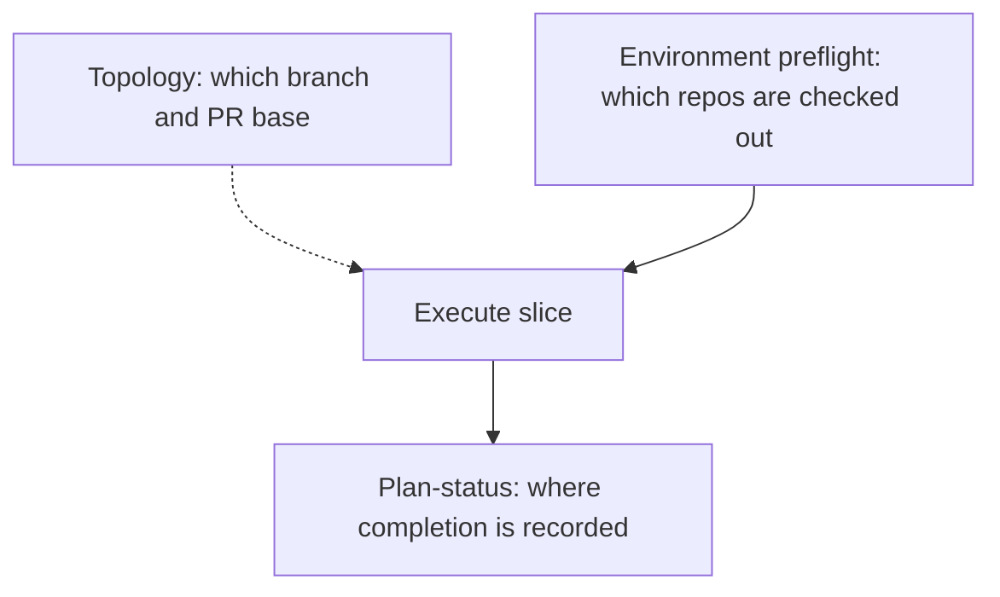

# Multi-repo execution preflight

## Recommended execution authority

| Slice                | Recommended authority | Agent instruction                                      |
| -------------------- | --------------------- | ------------------------------------------------------ |
| plan-review          | Plan-only PR          | Do not implement. Stop after opening the plan-only PR. |
| multi-repo-preflight | Open PR only          | Do not merge. Stop after opening the PR.               |
| plan-closure         | Open PR only          | Do not merge. Stop after opening the PR.               |

Repo default: **Open PR only** (see team skill `/planning-methodology`).

## Repository topology

Multi-slice plans stack execution order, not Git branches. Integration branch is `main`.

**Before implementation:** start from latest `origin/main`.

**Before opening the PR:** branch represents only this slice — prior-slice work is on the integration branch, not via branch ancestry.

**After opening the PR:** GitHub PR base is `main`; diff excludes prior-slice work except through merged `main`.

This plan is **same-repo / single-checkout**: it edits only `multipliers-dev/cursor-team-marketplace`. It does not itself require a multi-repo environment. The invariant it adds is for later slices that do.

---

## Problem

A Renovate extraction plan correctly described cross-repo work, but a Cloud Agent launched against only the target repo. The source repo was unavailable, so the agent reconstructed behavior from the plan and docs instead of extracting from source.

Cursor Cloud Agents support multi-repo environments. GitHub App access to other repositories is not evidence that the current job token or environment contains those checkouts.

The canonical skill already has strong **cross-repo completion** rules (plan-status PR) and a **repository topology** invariant (which branch/base each PR uses). It has no **execution-environment** invariant for which repositories must be present to run the slice.



**Terminology (keep both; do not merge them):**

- **Cross-repo slice** (existing): where the authoritative plan file lives vs where implementation lands → plan-status PR.
- **Multi-repo slice** (new): the slice must read, modify, validate against, migrate from, or migrate to another repository → environment preflight.

They compose. An extraction can be same-repo for completion (plan + impl in the target) and still multi-repo for execution (source checkout required).

---

## Slice — plan-review

**Recommended authority:** Plan-only PR

**Rationale:**

- Methodology change should land for review before editing the canonical skill
- Expected diff is plan artifact only

**Agent instruction:** Do not implement. Stop after opening the plan-only PR.

**Goal:** Commit this plan artifact only.

---

## Slice — multi-repo-preflight

**Recommended authority:** Open PR only

**Rationale:**

- One coherent skill change (SKILL + template/reference examples + version bump)
- Merge-safe without consumer-repo `planning-standards.md` edits or User Rules expansion

**Agent instruction:** Do not merge. Stop after opening the PR.

**Goal:** Add a hard multi-repo execution preflight to the canonical planning-methodology skill, distinct from topology and from plan-status completion recording.

**Prerequisite:** `plan-review` merged (or plan reviewed).

### What stays unchanged

Do not rewrite authority, topology, plan-status, or closure.

- [SKILL.md](../../plugins/team-harness/skills/planning-methodology/SKILL.md) item **5** (same-repo vs cross-repo **completion recording**) stays as-is.
- Closure item **1** (verify merged implementation PRs **and** the plan-status PR) stays as-is.
- Default same-repo prompts in [_template.plan.md](../../plugins/team-harness/skills/planning-methodology/_template.plan.md) (`### slice-1`, `### slice-2`, `### plan-closure`) stay four labeled lines: Authority / Topology / Deliverables / Verification. No `Repositories:` line.
- Existing plan-status variant keeps “mark completed in the plan-owning repo; do not edit the plan from the implementation repo.”
- Do not edit consumer-repo `planning-standards.md` / `_template.plan.md` copies. Do not edit [docs/engineering-invariants.md](../../docs/engineering-invariants.md) (User Rules stay short; this procedure lives in the skill).

### Exact new invariant (SKILL.md)

Insert a new section **immediately after** `## Repository topology invariant` and **before** `## Merge-safe PRs (generic)`:

```markdown
## Multi-repo environment preflight

Distinct from repository topology: topology answers which branch/base each PR uses; this preflight answers which repositories must be available to execute the slice. Distinct from cross-repo completion recording (item 5): plan-status answers where the todo is marked completed, not which checkouts the agent must have.

During plan authoring, every slice that reads, modifies, validates against, migrates from, or migrates to another repository must explicitly list its required repositories and each repository's role, for example:

Required repositories:
- multipliers-dev/source-repo — behavioral/source authority, read-only
- multipliers-dev/target-repo — implementation target, read/write

Every agent prompt for such a slice must include a multi-repo preflight **before any edits**. For each required repository, prove all three:

- confirm it exists as a real git checkout in the active environment (GitHub App / job-token access alone is not a checkout)
- confirm `git remote` / repository identity matches the expected owner/name
- perform the minimum capability check for its declared role:
  - read-only source or validation repo: open one named authoritative source path
  - write target: confirm the actual target checkout; later normal branch creation is enough — do not make a throwaway mutation

Hard-stop: if any required repository is missing, inaccessible, identity-mismatched, or not part of the active Cloud Agent environment, STOP before modifying files. Do not reconstruct, approximate, infer, or substitute source behavior from the plan, documentation, cached context, public mirrors, memory, or the target repository.

Cloud Agents: when a slice’s required repositories include more than one repository, use a multi-repo Cloud Agent environment containing every required repository. GitHub App access to those repositories is not sufficient evidence that the current job token or environment contains them.
```

The Cloud Agents trigger is the explicit **Required repositories** list (more than one repo), not a natural-language mention or a background link. A slice may name another repo as context without requiring that checkout.

### Small supporting edits

- Frontmatter `description` and **When to use**: mention multi-repo environment preflight.
- Item **7**: keep Authority / Topology / Deliverables / Verification as the default layout. Add one sentence: when the slice is multi-repo (needs another repository), also include a labeled `Repositories:` line. Do not change the same-repo vs plan-status completion-recording sentences.
- Optional item **10** (one line): slices that need another repo must list **Required repositories** in the slice body. Avoid restating the hard-stop here.

### Updated agent-prompt structure

**Same-repo / single-checkout (unchanged):**

```text
Authority: …
Topology: …
Deliverables: …
Verification: …
```

**Multi-repo (additional labeled line only):**

```text
Authority: …
Topology: …
Repositories: <repo + role list>; verify all are present/readable before implementation; hard-stop if not.
Deliverables: …
Verification: …
```

Extraction example line:

```text
Repositories: multipliers-dev/source-repo (behavioral/source authority, read-only), multipliers-dev/target-repo (implementation target, read/write); verify all are present/readable before implementation; hard-stop if not.
```

Place `Repositories` after `Topology` and before `Deliverables` so the four existing labels keep their meaning.

### Template and reference (minimal)

[_template.plan.md](../../plugins/team-harness/skills/planning-methodology/_template.plan.md)

- After **Repository topology (default)**, add a short **Multi-repo environment** note: list required repos + roles when a slice needs another checkout; topology ≠ environment; plan-status ≠ environment.
- Leave `### slice-1`, `### slice-2`, and `### plan-closure` byte-identical in labeled-line structure.
- Leave the **Plan-status PR** variant’s completion semantics unchanged (no `Repositories:` line — it executes in the plan-owning repo and checks the other repo via linked PRs / `gh`, not a required source checkout).
- Add one **Multi-repo extraction variant** (not a second `###` heading for a default todo id), showing:
  - slice-body **Required repositories** (source read-only / target read-write)
  - prompt with the `Repositories:` line
  - preflight must prove both are real checkouts, remotes match owner/name, the named source path opens, and the target checkout is the write repo — then copy/generalize from source
  - missing or identity-mismatched source repo → stop; never clean-room rebuild from docs
- One sentence on the existing cross-repo implementation variant: if that slice also needs a source/validation checkout, add `Repositories:`; do not replace the plan-status rule.

[reference.md](../../plugins/team-harness/skills/planning-methodology/reference.md)

- Keep the current same-repo and plan-status examples unchanged.
- Add the extraction prompt example with `Repositories:`.
- One author bullet + anti-pattern: missing source checkout → reconstruct from the plan/docs/target repo.

### Version bump

Same convention as prior skill PRs: bump [plugins/team-harness/.cursor-plugin/plugin.json](../../plugins/team-harness/.cursor-plugin/plugin.json) and [.cursor-plugin/marketplace.json](../../.cursor-plugin/marketplace.json) from whatever is on `origin/main` at implement time (currently **1.8.0** → **1.9.0**).

### Files to change (this repo only)

- [`plugins/team-harness/skills/planning-methodology/SKILL.md`](../../plugins/team-harness/skills/planning-methodology/SKILL.md)
- [`plugins/team-harness/skills/planning-methodology/_template.plan.md`](../../plugins/team-harness/skills/planning-methodology/_template.plan.md)
- [`plugins/team-harness/skills/planning-methodology/reference.md`](../../plugins/team-harness/skills/planning-methodology/reference.md)
- [`plugins/team-harness/.cursor-plugin/plugin.json`](../../plugins/team-harness/.cursor-plugin/plugin.json)
- [`.cursor-plugin/marketplace.json`](../../.cursor-plugin/marketplace.json)

### Acceptance

- [ ] SKILL.md has `## Multi-repo environment preflight` after topology, with the exact invariant, three-part preflight, hard-stop, and Cloud Agents sentence tied to **Required repositories** (not “mentions multiple repositories”)
- [ ] Item 7 still requires Authority / Topology / Deliverables / Verification; `Repositories:` is additional only for multi-repo slices
- [ ] Item 5, plan-status variant, and closure item 1 are unchanged
- [ ] `_template.plan.md` `### slice-1` / `### slice-2` / `### plan-closure` keep four labeled lines
- [ ] Template and reference include the extraction example (source-repo read-only, target-repo read/write)
- [ ] plugin.json and marketplace.json bumped from `main`
- [ ] `sh scripts/check.sh` passes

### Explicit non-goals

- Redesigning authority, topology, plan-status, or closure
- Expanding [docs/engineering-invariants.md](../../docs/engineering-invariants.md)
- Editing consumer-repo planning-standards or `_template.plan.md` copies

---

## Plan closure (docs-only PR)

**Recommended authority:** Open PR only

**Rationale:**

- Docs-only archival; human review of closure checklist

**Agent instruction:** Do not merge. Stop after opening the PR.

After `multi-repo-preflight` merges:

1. Verify the implementation PR is actually merged to `main` (not merely frontmatter `completed`)
2. Verify remaining todos are `completed` or `cancelled`
3. Add `# Shipped` with date, PR links, deferred work
4. Move to `.cursor/plans/archive/2026-08-31-multi-repo-preflight.plan.md`
5. Mark `plan-closure` completed; update agent prompt references to the archived path
6. No production behavior changes

---

## Agent prompts (copy/paste for Cursor)

Use a **fresh Agent-mode chat** per slice. Each default frontmatter todo has exactly one `### <todo-id>` heading copied from that todo’s `id` — do not rename ids to match prose.

### plan-review

```text
@.cursor/plans/2026-08-31-multi-repo-preflight.plan.md

Execute only plan-review. Do not start implementation slices.

Authority: Plan-only PR — commit the plan artifact only; do not implement. Stop after opening the plan-only PR.

Topology: start from latest origin/main; branch represents only the plan artifact; PR base must be main.

Deliverables: plan file under .cursor/plans/; mark plan-review completed in plan frontmatter in this PR.

Verification: plan satisfies planning-methodology envelope; source mermaid, exact invariant, three-part preflight, and Cloud Agents Required-repositories trigger preserved in the executing slice (not prose-only); no skill, template, reference, or plugin.json changes included.
```

### multi-repo-preflight

```text
@.cursor/plans/2026-08-31-multi-repo-preflight.plan.md

Implement slice multi-repo-preflight only. Prerequisite: plan-review merged. Do not start plan-closure. Do not archive the plan.

Authority: Open PR only — implement and open the PR; do not merge.

Topology: start from latest origin/main; branch represents only this slice; PR base must be main.

Deliverables: add ## Multi-repo environment preflight to planning-methodology SKILL.md immediately after topology (exact invariant, three-part preflight, hard-stop, Cloud Agents sentence tied to Required repositories); extend item 7 with Repositories labeled line for multi-repo slices only; demonstrate extraction example in _template.plan.md and reference.md; leave same-repo prompts and plan-status/closure semantics unchanged; bump plugin.json and marketplace.json from whatever is on main. Mark multi-repo-preflight completed in plan frontmatter in this PR.

Verification: sh scripts/check.sh; quote the new invariant; show same-repo four-line vs multi-repo five-line prompt; confirm ### slice-1 / ### slice-2 / ### plan-closure labeled-line set unchanged; confirm item 5, plan-status variant, and closure item 1 unchanged.
```

### plan-closure

```text
@.cursor/plans/2026-08-31-multi-repo-preflight.plan.md

Execute only plan-closure.

Authority: Open PR only — docs-only archive PR; do not merge.

Prerequisites: implementation PRs actually merged to main (not merely frontmatter completed).

Topology: start from latest origin/main; branch represents only this slice; PR base must be main.

Deliverables: verify slice todos, add # Shipped note, move plan to .cursor/plans/archive/2026-08-31-multi-repo-preflight.plan.md, mark plan-closure completed, update agent prompt references to the archived path.

Verification: confirm all prerequisite implementation PRs are merged and slice todos are completed before archiving.
```
