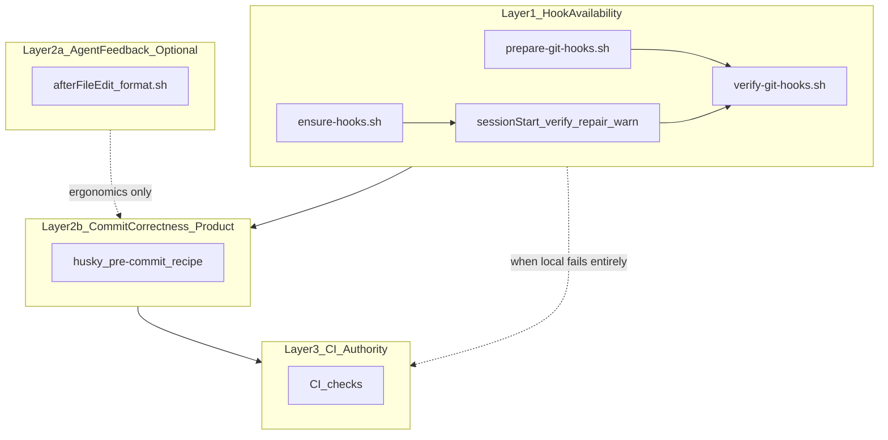
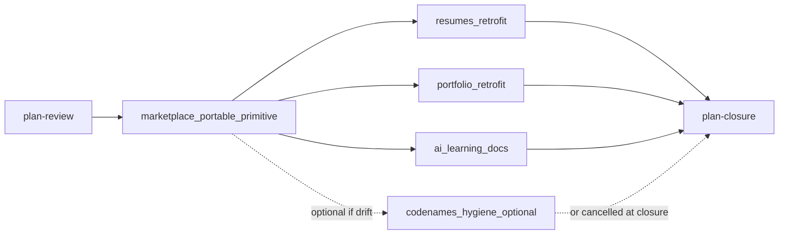

# Hook stack alignment across workspace repos

## Problem

The Lorikeet plan-closure CI failure exposed **silent hook skip** — not fundamentally a Prettier problem. A fresh worktree can have `core.hooksPath=.husky/_` while Husky shims under `.husky/_` do not exist yet. Git then commits without running the intended checks.

Prettier-invalid markdown was a **symptom**. The root cause is inferring enforcement from configuration instead of verifying that enforcement is runnable.

## Architecture (four layers)

Do not blur hook infrastructure with formatting ergonomics. Each layer answers a different question:

| Layer | Question | Mechanism | Failure mode addressed |
| --- | --- | --- | --- |
| **1 — Hook availability** | Are this repo's Git hooks actually wired and runnable in *this* checkout? | `prepare-git-hooks.sh` + `verify-git-hooks.sh` + `ensure-hooks.sh`; **sessionStart verifies runnable state** | Silent skip (worktree, stale shims, Cloud bridge race) |
| **2a — Agent feedback** | Can agent edits stay formatted while working? | Optional `afterFileEdit` → `format.sh` | Formatting churn during agent sessions; **not** a Husky substitute |
| **2b — Commit correctness** | What must pass before a commit lands locally? | Product `.husky/pre-commit` recipe (lint-staged, lint, typecheck, format:check, …) | Malformed commits **when Layer 1 is functioning** |
| **3 — Authoritative enforcement** | What is the backstop when local/agent machinery fails? | CI (`format:check`, lint, typecheck, …) | Any bypass of local hooks |



### Core invariant (document everywhere)

> **An agent must not assume Git hooks are active merely because `core.hooksPath` is configured.**

Configured path ≠ runnable shims. Verification must check **actual executable hook state** in the current checkout/worktree.

### Ownership model

- **Marketplace** owns portable Layer 1 (+ optional Layer 2a primitive script).
- **Consuming repos vendor a snapshot** (copy at retrofit time). No runtime coupling to marketplace paths or workspace topology.
- **Repos decide Layer 2b** — savepoints/renovate-workflow (test+typecheck) vs Prettier repos (lint-staged + format:check) demonstrate this split.

Codenames is the **reference product**; [plugins/team-harness/](plugins/team-harness/) is the **canonical portable source** (functionally aligned after [worktree-hooks-backport](archive/2026-08-26-worktree-hooks-backport.plan.md)).

## Current state (workspace)

| Repo | Layer 1 | Layer 2a | Layer 2b | Layer 3 |
| --- | --- | --- | --- | --- |
| **codenames-ai-guesser** | Full | Full | Full pre-commit | CI |
| **savepoints** | Full (vendored) | — | test+typecheck | CI |
| **renovate-workflow** | Full (vendored) | — | test+typecheck | CI |
| **resumes** | **Stale** (pre-#546 prepare; no verify) | — | lint-staged only (**no format:check**) | CI |
| **portfolio** | **Stale** | — | lint-staged + format:check | CI |
| **ai-learning** | **Missing** | — | lint-staged only | varies |
| **cursor-team-marketplace** | Source of truth | gap | N/A | check.sh |

## Locked decisions

- **Four layers, vendored snapshots:** copy Layer 1 from marketplace; customize 2b per repo; 2a optional for Prettier/agent-heavy repos.
- **Layer 2a is ergonomics/redundancy, not Cloud Husky:** it does not enforce lint, typecheck, or other pre-commit invariants.
- **Layer 1 must detect silent hook failure:** sessionStart (and prepare) verify runnable shims; repair when possible; **visible warning** when not (sessionStart remains fail-open for session boot; message must be actionable).
- **Do not** add Prettier/Layer 2a to greenfield [`/repo-bootstrap`](../../plugins/team-harness/skills/repo-bootstrap/SKILL.md) (test+typecheck only).
- **Do** document optional Layer 2a in [`/cloud-hooks-bootstrap`](../../plugins/team-harness/skills/cloud-hooks-bootstrap/SKILL.md).
- **No runtime marketplace coupling** in product repos (copy-only vendoring).
- **ai-learning:** document gap only; no retrofit PR.
- **Each slice:** Open PR only; one repo per PR; branch from latest `origin/main`.
- **Single repair definition (Layer 1):** `prepare-git-hooks.sh` and `session-ensure-git-hooks.sh` must share one helper for “hooks need repair” detection and shim repair when the logic is non-trivial — do not maintain two divergent copies of `needs_husky_shim_repair` / husky re-run behavior.
- **Plan frontmatter lives in cursor-team-marketplace only:** consumer-repo PRs (resumes, portfolio, codenames) do **not** edit this plan. Mark their todos `completed` or `cancelled` in a marketplace PR (implementation slice when repo is marketplace; otherwise plan-closure after verifying merges).

## Recommended execution authority

| Slice | Recommended authority | Agent instruction |
| --- | --- | --- |
| plan-review | Plan-only PR | Do not implement. Stop after opening the plan-only PR. |
| marketplace-portable-primitive | Open PR only | Do not merge. Stop after opening the PR. |
| resumes-hook-retrofit | Open PR only | Do not merge. Stop after opening the PR. |
| portfolio-hook-retrofit | Open PR only | Do not merge. Stop after opening the PR. |
| codenames-hygiene | Open PR only | Do not merge. Stop after opening the PR. |
| ai-learning-docs | Open PR only | Do not merge. Stop after opening the PR. |
| plan-closure | Open PR only | Do not merge. Stop after opening the PR. |

---

## Slice — plan-review (cursor-team-marketplace)

**Authority:** Plan-only PR

Commit this plan aligned with planning standards. No implementation.

---

## Slice — marketplace-portable-primitive (cursor-team-marketplace)

**Authority:** Open PR only

**Prerequisite:** plan-review merged.

**Goal:** Make silent hook failure detectable at the portable primitive layer; optionally ship Layer 2a as a copyable ergonomics script. Do not change greenfield bootstrap scope.

### Layer 1 — runnable hook verification at session start

Enhance [`plugins/team-harness/scripts/session-ensure-git-hooks.sh`](../../plugins/team-harness/scripts/session-ensure-git-hooks.sh) (copied to `.cursor/hooks/ensure-git-hooks.sh` in repos):

1. Existing: rechain `ensure-hooks.sh` (Cloud agent-hooks bridge).
2. **New:** run `verify-git-hooks.sh` against the **current checkout**.
3. **On verify failure:** attempt shim repair via a **shared helper** sourced from the same logic as [`prepare-git-hooks.sh`](../../plugins/team-harness/scripts/prepare-git-hooks.sh) (`needs_husky_shim_repair` / husky re-run). **Extract** `scripts/husky-shim-repair.sh` (or equivalent) if repair/detection is non-trivial — sessionStart must call the helper, not reimplement detection inline.
4. **If still failing:** emit a **visible, actionable warning** to stderr (e.g. `HOOKS NOT RUNNABLE: run npm run prepare in this checkout before committing`). SessionStart remains fail-open (do not block session boot).
5. Re-verify after repair attempt when repair ran.

Document the invariant in [`docs/engineering-invariants.md`](../../docs/engineering-invariants.md) and [`cloud-hooks-bootstrap/SKILL.md`](../../plugins/team-harness/skills/cloud-hooks-bootstrap/SKILL.md):

- `core.hooksPath` configured ≠ hooks runnable
- After `git worktree add`: `npm run prepare` or `npm run verify:git-hooks`
- Plugin install ≠ repo wired

### Layer 2a — optional agent feedback primitive (copy-only)

1. **Add** [`plugins/team-harness/scripts/format-after-edit.sh`](../../plugins/team-harness/scripts/format-after-edit.sh) — vendored from codenames [`.cursor/hooks/format.sh`](../../../codenames-ai-guesser/.cursor/hooks/format.sh) behavior (fail-open Prettier; path-safe; rechains ensure-hooks). **Consuming repos copy the file; no runtime import from marketplace.**
2. **Extend** cloud-hooks skill: optional copy → `.cursor/hooks/format.sh` + `afterFileEdit` in `hooks.json`. Explicitly label as **agent ergonomics / redundant formatting path** — not a substitute for Husky or pre-commit lint/typecheck.

### Template / tests / version

- Polish [`templates/repo/.cursor/hooks.json`](../../plugins/team-harness/templates/repo/.cursor/hooks.json): `timeout: 15` on sessionStart only.
- **Tests** in [`scripts/check.sh`](../../scripts/check.sh):
  - Extend or add smoke: broken worktree shims → session script warns and/or repairs (assert stderr sentinel or post-repair verify pass).
  - Optional: format-after-edit in-repo vs outside-repo.
- Bump [`plugins/team-harness/.cursor-plugin/plugin.json`](../../plugins/team-harness/.cursor-plugin/plugin.json) and [`.cursor-plugin/marketplace.json`](../../.cursor-plugin/marketplace.json) patch version (same convention as prior team-harness slices).

**Out of scope:** Prettier in repo-bootstrap template; runtime coupling to marketplace from product repos; porting full codenames vitest suite.

**Verification:** `scripts/check.sh` green; skill docs distinguish Layer 1 vs 2a vs 2b vs 3.

---

## Slice — resumes-hook-retrofit (resumes)

**Authority:** Open PR only

**Prerequisite:** marketplace-portable-primitive merged.

**Goal:** Fix stale Layer 1; strengthen Layer 2b (primary local enforcement for formatting). Add Layer 2a as optional ergonomics.

### Layer 1 — vendor marketplace snapshot

- Replace [`scripts/prepare-git-hooks.sh`](../../../resumes/scripts/prepare-git-hooks.sh), add [`scripts/verify-git-hooks.sh`](../../../resumes/scripts/verify-git-hooks.sh), sync [`scripts/ensure-hooks.sh`](../../../resumes/scripts/ensure-hooks.sh).
- Replace [`.cursor/hooks/ensure-git-hooks.sh`](../../../resumes/.cursor/hooks/ensure-git-hooks.sh) with updated session script from marketplace.
- Add `"verify:git-hooks": "sh scripts/verify-git-hooks.sh"` to [`package.json`](../../../resumes/package.json).

### Layer 2b — commit correctness

Strengthen [`.husky/pre-commit`](../../../resumes/.husky/pre-commit):

- `lint-staged` → `lint` → `typecheck` → **`format:check`**
- Do not add full `npm run check` / `site:check` (too heavy per commit).

### Layer 2a — agent feedback (optional ergonomics)

- Copy marketplace `format-after-edit.sh` → [`.cursor/hooks/format.sh`](../../../resumes/.cursor/hooks/format.sh).
- Wire [`hooks.json`](../../../resumes/.cursor/hooks.json) `afterFileEdit` (30s timeout).

### Docs

Update [`AGENTS.md`](../../../resumes/AGENTS.md): four-layer model, **hooksPath ≠ runnable**, worktree prepare, verify:git-hooks, Layer 2a is not Cloud Husky.

**Verification:**

- `npm run verify:git-hooks` passes in primary checkout.
- Worktree smoke: without prepare → verify fails / session warns; after prepare → commit runs pre-commit.
- `npm run check` green.

---

## Slice — portfolio-hook-retrofit (portfolio)

**Authority:** Open PR only

**Prerequisite:** marketplace-portable-primitive merged.

**Same Layer 1 vendor snapshot as resumes.**

**Layer 2b:** [`.husky/pre-commit`](../../../portfolio/.husky/pre-commit) already includes format:check — **keep recipe**.

**Layer 2a:** copy format.sh + hooks.json afterFileEdit.

**Docs:** [`AGENTS.md`](../../../portfolio/AGENTS.md) — same invariants as resumes.

**Verification:** same as resumes.

---

## Slice — codenames-hygiene (codenames-ai-guesser)

**Authority:** Open PR only

**Optional / low-churn:** only if drift found while vendoring into resumes/portfolio. **If no drift after consumer retrofits, skip this slice** — plan-closure marks `codenames-hygiene` `cancelled` with rationale (no drift; codenames already aligned).

- Compare codenames vendored scripts with marketplace canonical (`prepare`, `verify`, `ensure`, session shim, `format.sh`).
- **Comment/copy-only** updates if drift exists; re-vendor snapshot if marketplace gained Layer 1 session verify behavior.
- **No runtime coupling** to marketplace (no shared imports, no workspace-path dependencies).
- If executed: mark `codenames-hygiene` `completed` in a **marketplace plan-status PR** (or plan-closure if batched) — not from codenames repo alone unless that PR also updates this plan file.

**Out of scope:** changing pre-commit recipe or Cloud lifecycle scripts unless required to match vendored Layer 1 behavior.

---

## Slice — ai-learning-docs (minimal)

**Authority:** Open PR only (marketplace docs-only)

**No ai-learning code PR.**

- Add ai-learning to cloud-hooks skill “known legacy outliers”: plain `prepare: husky`, no Layer 1 portable stack, no runnable-hook verification.

---

## Slice — plan-closure (cursor-team-marketplace)

**Authority:** Open PR only

**Prerequisites:** required implementation slices merged; frontmatter reflects `completed` or `cancelled` for every implementation todo (`codenames-hygiene` may be `cancelled` when skipped for no drift).

After verification: `# Shipped` note, move to `archive/`, mark remaining todos (`resumes-hook-retrofit`, `portfolio-hook-retrofit`, and any batched consumer todos not yet updated) `completed` or `cancelled`, mark `plan-closure` `completed`, update agent prompt paths.

---

## Execution order



Slices 2 and 3 parallel after marketplace slice merges.

---

## What we are not doing

- Treating `afterFileEdit` as Cloud substitute for Husky or pre-commit lint/typecheck.
- Runtime coupling between product repos and marketplace plugin paths.
- Forcing savepoints/renovate-workflow to adopt Prettier or Layer 2a.
- Full ai-learning infrastructure migration.
- Adding full `npm run check` to pre-commit.
- Prettier in greenfield repo-bootstrap.
- Single mega-PR across repos.

---

## Success criteria

- **Layer 1:** Fresh worktree without prepare → `verify:git-hooks` fails; sessionStart emits visible warning; after `npm run prepare` → shims runnable and pre-commit executes (resumes + portfolio).
- **Layer 2b:** resumes pre-commit runs `format:check` before CI; portfolio unchanged recipe still works with fresh Layer 1.
- **Layer 2a:** Agent markdown edits may get Prettier via afterFileEdit — **redundant ergonomics only**; success does not depend on this for hook correctness.
- **Layer 3:** CI remains authoritative when local/agent paths fail entirely.
- **Invariant documented:** configured `core.hooksPath` does not prove hooks are runnable.
- Marketplace primitive updated once; two independent consumers (resumes, portfolio) successfully adopt vendored snapshots.
- ai-learning gap documented; no aesthetic-only migration.

---

## Agent prompts (copy/paste for Cursor)

### plan-review

```text
@.cursor/plans/2026-09-01-hook-stack-alignment.plan.md

Execute only plan-review. Do not start implementation slices.

Authority: Plan-only PR — commit the plan artifact only; do not implement. Stop after opening the plan-only PR.

Topology: start from latest origin/main in cursor-team-marketplace; branch represents only the plan artifact; PR base must be main.

Deliverables: commit .cursor/plans/2026-09-01-hook-stack-alignment.plan.md aligned with planning standards (four-layer architecture, runnable-hook invariant, vendored snapshot ownership, agent prompts, plan-closure). Mark plan-review completed in frontmatter in the same PR.

Verification: plan satisfies repo planning standards; no hook script or consumer repo changes included.
```

### marketplace-portable-primitive

```text
@.cursor/plans/2026-09-01-hook-stack-alignment.plan.md

Implement slice marketplace-portable-primitive only in cursor-team-marketplace. Prerequisite: plan-review merged. Do not start consumer retrofits or plan-closure.

Authority: Open PR only — implement and open the PR; do not merge.

Topology: start from latest origin/main; branch represents only this slice; PR base must be main.

Deliverables: Layer 1 sessionStart verify/repair/warn in session-ensure-git-hooks.sh; shared husky-shim-repair helper (single repair definition with prepare-git-hooks.sh — no duplicated detection logic); optional format-after-edit.sh; cloud-hooks skill + engineering-invariants updates; template hooks.json timeout; tests in check.sh; bump plugins/team-harness/.cursor-plugin/plugin.json and .cursor-plugin/marketplace.json. Document that core.hooksPath ≠ runnable hooks. Mark marketplace-portable-primitive completed in frontmatter in this PR.

Verification: check.sh green including runnable-hook smoke; prepare and sessionStart call the same repair helper; no Prettier added to repo-bootstrap template; no runtime coupling pattern introduced.
```

### resumes-hook-retrofit

```text
@.cursor/plans/2026-09-01-hook-stack-alignment.plan.md

Implement slice resumes-hook-retrofit only. Prerequisite: marketplace-portable-primitive merged. Do not start portfolio, codenames, or plan-closure.

Authority: Open PR only — implement and open the PR; do not merge.

Topology: start from latest origin/main in resumes; branch represents only this slice; PR base must be main.

Deliverables: vendor marketplace Layer 1 scripts; Layer 2b pre-commit adds format:check; optional Layer 2a format.sh copy; AGENTS.md four-layer invariants. Do not edit plan frontmatter from this PR (plan lives in cursor-team-marketplace only).

Verification: verify:git-hooks + worktree smoke; npm run check green; afterFileEdit is documented as ergonomics not Husky substitute.
```

### portfolio-hook-retrofit

```text
@.cursor/plans/2026-09-01-hook-stack-alignment.plan.md

Implement slice portfolio-hook-retrofit only. Prerequisite: marketplace-portable-primitive merged. Do not start plan-closure.

Authority: Open PR only — implement and open the PR; do not merge.

Topology: start from latest origin/main in portfolio; branch represents only this slice; PR base must be main.

Deliverables: vendor marketplace Layer 1; Layer 2a format.sh copy; keep existing Layer 2b pre-commit; AGENTS.md invariants. Do not edit plan frontmatter from this PR (plan lives in cursor-team-marketplace only).

Verification: verify:git-hooks + worktree smoke; npm run check green.
```

### codenames-hygiene

```text
@.cursor/plans/2026-09-01-hook-stack-alignment.plan.md

Implement slice codenames-hygiene only if drift exists after marketplace slice and consumer retrofits. Optional slice — if skipped, plan-closure marks `codenames-hygiene` cancelled.

Authority: Open PR only — implement and open the PR; do not merge.

Deliverables: compare vendored scripts vs marketplace canonical; comment/copy-only or re-vendor snapshot. No runtime marketplace coupling. If executed, update plan frontmatter from a marketplace PR (same PR if codenames changes are paired with plan-status, or defer to plan-closure).

Verification: no new cross-repo imports; test:scripts green if touched.
```

### ai-learning-docs

```text
@.cursor/plans/2026-09-01-hook-stack-alignment.plan.md

Implement slice ai-learning-docs only (marketplace docs). No ai-learning code changes.

Authority: Open PR only — do not merge.

Deliverables: legacy outlier note in cloud-hooks skill. Mark ai-learning-docs completed in plan frontmatter.

Verification: docs-only in marketplace PR.
```

### plan-closure

```text
@.cursor/plans/2026-09-01-hook-stack-alignment.plan.md

Execute only plan-closure in cursor-team-marketplace.

Authority: Open PR only — docs-only archive PR; do not merge.

Prerequisites: required implementation slices merged; frontmatter shows `completed` or `cancelled` for each implementation todo (including `codenames-hygiene` cancelled when skipped).

Deliverables: verify merged PRs; mark consumer-repo todos completed if not already; mark skipped `codenames-hygiene` cancelled if applicable; add # Shipped note; move plan to archive/; mark plan-closure completed; update agent prompt references.

Verification: confirm prerequisite PRs merged before archiving.
```
