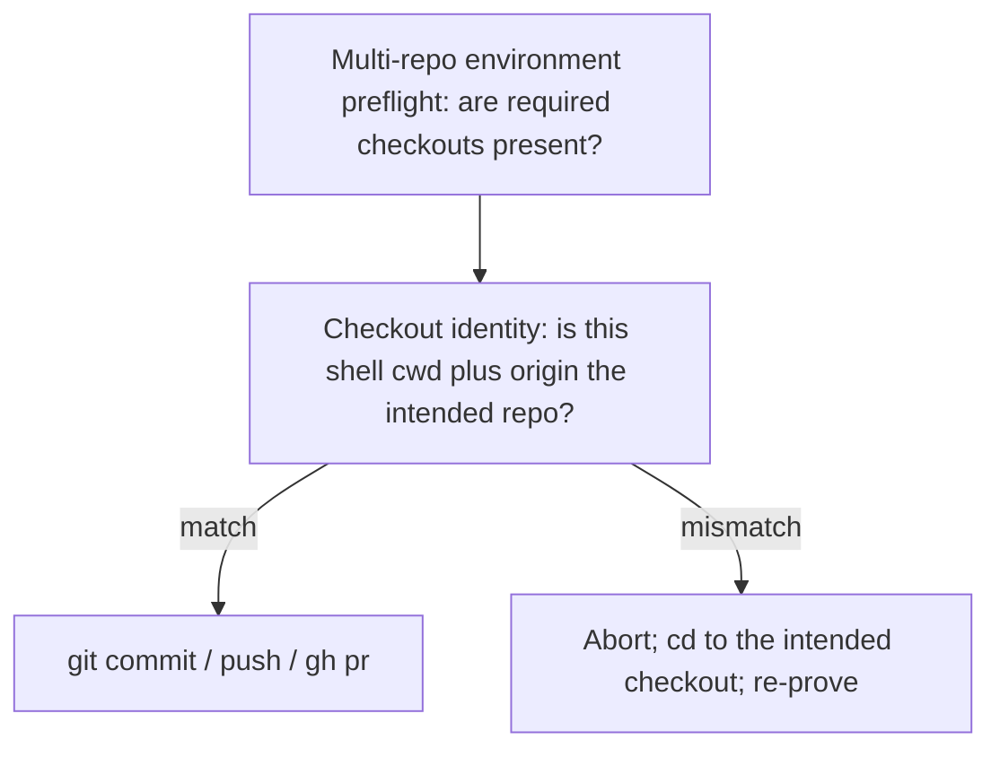

# Checkout identity before git/gh

This PR is **Plan-only**. Do not begin implementation on this branch.

Source: [Improvement card](https://app.notion.com/p/3d06cffaff9c81f3be46eaeeb1621b23) (High). Evidence: [Savepoint](https://app.notion.com/p/3d06cffaff9c819fb200e52521e61421) — Shell `working_directory=/Users/michaeltruong/code/savepoints-demo` still started in the first multi-root checkout (`codenames-ai-guesser`).

## Recommended execution authority

| Slice             | Recommended authority | Agent instruction                                      |
| ----------------- | --------------------- | ------------------------------------------------------ |
| plan-review       | Plan-only PR          | Do not implement. Stop after opening the plan-only PR. |
| checkout-identity | Open PR only          | Do not merge. Stop after opening the PR.               |
| plan-closure      | Open PR only          | Do not merge. Stop after opening the PR.               |

Repo default: **Open PR only** (see team skill `/planning-methodology`).

- **plan-review** — Plan-only PR. Plan artifact only. Stop after opening. Do not implement. Do not merge.
- **checkout-identity** — Open PR only, targeting `main`. Do not merge unless Merge granted is explicit.
- **plan-closure** — Open PR only. Docs-only archive after `checkout-identity` merges.

## Repository topology

Multi-slice plans stack execution order, not Git branches. Integration branch is `main`.

**Before implementation:** start from latest `origin/main`.

**Before opening the PR:** branch represents only this slice — prior-slice work is on the integration branch, not via branch ancestry.

**After opening the PR:** GitHub PR base is `main`; diff excludes prior-slice work except through merged `main`.

This plan is **same-repo / single-checkout**: it edits only `multipliers-dev/cursor-team-marketplace`. Notion status on the Improvement card is a side write, not a second code repo.

---

## Why not savepoints-demo AGENTS.md

The card says “AGENTS.md **or a shared workflow note**.” A demo-only AGENTS.md line would not apply across repos and would drift.

House style for always-on cross-repo agent instructions is the same as [keep-pr-metadata](archive/2026-08-28-keep-pr-metadata-current.plan.md):

- Short bullets in [`docs/engineering-invariants.md`](../../docs/engineering-invariants.md) (User Rules paste)
- Procedure in [`plugins/team-harness/skills/planning-methodology/SKILL.md`](../../plugins/team-harness/skills/planning-methodology/SKILL.md)
- **Do not** copy into consumer-repo `AGENTS.md` / `merge-safe-prs.mdc`
- After merge, **re-paste** the invariants file into Cursor User Rules (plugin install does not update User Rules)

## Two checks that must stay distinct



Existing **Multi-repo environment preflight** answers “which repos must be available for this slice.” It does **not** catch a Shell that ignored `working_directory` and landed in the first workspace root.

**Checkout identity** runs before any git mutation or `gh` write, including single-repo work in a multi-root workspace.

---

## Slice — plan-review

**Recommended authority:** Plan-only PR

**Rationale:**

- Methodology change should land for review before editing the always-on invariants paste and the portable skill

**Agent instruction:** Do not implement. Stop after opening the plan-only PR.

**Goal:** Commit this plan artifact only.

**Acceptance:** PR contains only the plan file (plus planning-standard alignment if needed). No invariants, skill, or version changes.

---

## Slice — checkout-identity

**Recommended authority:** Open PR only

**Rationale:**

- Single merge-safe concern: invariants bullets, skill distinction, and version bump ship together
- No product behavior; User Rules re-paste is an operator step after merge, not a code change

**Agent instruction:** Do not merge. Stop after opening the PR.

**Goal:** Bake checkout identity into the always-on paste and the planning-methodology procedure.

### What to add

**Invariant** (new short section in [`docs/engineering-invariants.md`](../../docs/engineering-invariants.md), after **PR execution**):

- Before any `git` mutation or `gh` write (commit, push, branch create, `gh pr create` / `edit` / `merge`), prove the shell is in the intended checkout: `pwd` and `git remote get-url origin`.
- Do not trust Shell `working_directory` alone in multi-root workspaces — it can start in the first listed root.
- Abort if the remote owner/repo is not the intended target. `cd` to the correct checkout and re-prove before continuing.

**Skill** (short subsection in planning-methodology, next to Multi-repo environment preflight — do not merge the two):

- Same three bullets as procedure, plus: this check is required even when the slice is single-checkout.
- No new skill, hook, or GitHub Action.

**Version:** bump [`plugins/team-harness/.cursor-plugin/plugin.json`](../../plugins/team-harness/.cursor-plugin/plugin.json) and [`.cursor-plugin/marketplace.json`](../../.cursor-plugin/marketplace.json) from whatever is on `origin/main` at implement time (currently **1.9.1** → **1.10.0**).

**Notion:** set the Improvement [Status](https://app.notion.com/p/3d06cffaff9c81f3be46eaeeb1621b23) to `In Progress` when the implementation PR opens; `Done` after that PR merges **and** User Rules are re-pasted.

### Operator step after merge (required for always-on)

Re-paste [`docs/engineering-invariants.md`](../../docs/engineering-invariants.md) into the Cursor User Rule that currently holds that paste. Until that happens, only chats that invoke `/planning-methodology` will see the new procedure.

### Verification

- Invariants stay short.
- Skill distinguishes preflight vs cwd/origin proof and does not merge the two sections.
- Versions bump from `main`.
- No consumer `AGENTS.md` edits.

### Explicit non-goals

- Fan-out to consumer `AGENTS.md` files (including savepoints-demo)
- Changing the `creating-pull-requests` Cursor user rule
- A team-harness `alwaysApply` Cursor rule (plugin install still does not install rules)
- Teaching Shell `working_directory` itself — this is an instruction the agent evaluates before git/gh, not a hook
- GitHub Actions or Cursor hooks

**Cloud residual:** User Rules are desktop always-on. Cloud Agents that never load planning-methodology will not see the skill copy. Same residual as keep-pr-metadata; do not fan out AGENTS.md to close it.

---

## Slice — plan-closure

**Recommended authority:** Open PR only

**Rationale:**

- Docs-only archival; human review of closure checklist

**Agent instruction:** Do not merge. Stop after opening the PR.

After `checkout-identity` is **merged** to `main`:

1. Verify implementation PRs are actually merged to `main` — do not trust frontmatter `completed` state alone.
2. Verify remaining todos are `completed` or `cancelled`.
3. Add `# Shipped` with date, PR links, deferred work.
4. Move the plan to `.cursor/plans/archive/2026-09-03-checkout-identity.plan.md`.
5. Mark `plan-closure` completed; update agent prompt path references.

Operator step (not a code change): re-paste [`docs/engineering-invariants.md`](../../docs/engineering-invariants.md) into Cursor User Rules, then set Improvement Status to `Done`.

---

## Agent prompts (copy/paste for Cursor)

Use a **fresh Agent-mode chat** per slice. Each default frontmatter todo has exactly one `### <todo-id>` heading copied from that todo’s `id`.

### plan-review

```text
@.cursor/plans/2026-09-03-checkout-identity.plan.md

Implement slice plan-review only. Do not start checkout-identity or plan-closure. Do not edit engineering-invariants.md or planning-methodology.

Authority: Plan-only PR — plan artifact only; stop after opening the PR; do not implement; do not merge.

Topology: start from latest origin/main; branch represents only this slice; PR base must be main.

Deliverables: commit .cursor/plans/2026-09-03-checkout-identity.plan.md with this plan’s envelope. Mark plan-review completed in plan frontmatter in this PR.

Verification: PR contains only the plan file (plus planning-standard alignment if needed); no invariants, skill, or version changes.
```

### checkout-identity

```text
@.cursor/plans/2026-09-03-checkout-identity.plan.md

Implement slice checkout-identity only. Do not start plan-closure. Do not edit consumer-repo AGENTS.md files.

Authority: Open PR only — implement and open the PR; do not merge.

Topology: start from latest origin/main; branch represents only this slice; PR base must be main.

Deliverables: add Checkout identity bullets to docs/engineering-invariants.md; add a distinct subsection in planning-methodology SKILL.md (do not merge with Multi-repo environment preflight); bump plugin.json and marketplace.json from origin/main. Mark checkout-identity completed in plan frontmatter in this PR. Set the Improvement card Status to In Progress.

Verification: invariants stay short; skill distinguishes preflight vs cwd/origin proof; versions bump from main; no consumer AGENTS.md edits.
```

### plan-closure

```text
@.cursor/plans/2026-09-03-checkout-identity.plan.md

Execute only plan-closure.

Authority: Open PR only — docs-only archive PR; do not merge.

Prerequisites: implementation PRs actually merged to main (not merely frontmatter completed).

Topology: start from latest origin/main; branch represents only this slice; PR base must be main.

Deliverables: verify slice todos, add # Shipped note, move plan to .cursor/plans/archive/2026-09-03-checkout-identity.plan.md, mark plan-closure completed, update agent prompt references to the archived path. Remind the operator to re-paste docs/engineering-invariants.md into User Rules, then set the Improvement card Status to Done.

Verification: confirm the implementation PR is merged and slice todos are completed before archiving.
```
