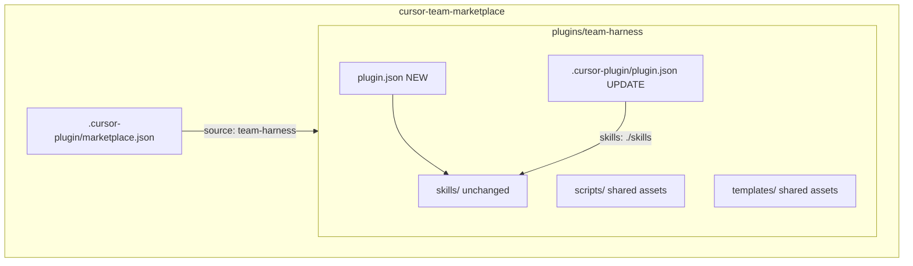

# Agent Plugins 1.0 migration for team-harness

## Recommended execution authority

| Slice | Recommended authority | Agent instruction |
| --- | --- | --- |
| plan-review | Plan-only PR | Do not implement. Stop after opening the plan-only PR. |
| agent-plugins-migration | Open PR only | Do not merge. Stop after opening the PR. |
| plan-closure | Open PR only | Do not merge. Stop after opening the PR. |

Repo default: **Open PR only**.

---

## Architectural statement (read first)

Agent Plugins compatibility here is **package-level syntactic compatibility**, not a claim that every discovered skill is cross-client functional.

The spec’s fixed discovery model (`skills/`) exposes all three skills to any Agent Plugins-compatible client:

```text
skills/
├── planning-methodology       ← cross-client (procedure; Cursor paths are conventions)
├── repo-bootstrap             ← Cursor-dependent as shipped
└── cloud-hooks-bootstrap      ← Cursor-dependent
```

The portable `plugin.json` describes the **primary cross-client capability** (planning methodology). Documentation and manifest wording must **not** imply that Agent Plugins discovery makes `repo-bootstrap` or `cloud-hooks-bootstrap` cross-client portable. Keeping Cursor-dependent skills in `skills/` is a deliberate trade-off: one skill tree, standard discovery, honest per-skill classification—not a second directory or duplicated trees.

After this migration, two reference implementations exist:

```text
renovate-workflow
    Agent Plugin ≈ portable workflow (+ Cursor extensions)

team-harness
    Agent Plugin package (syntactic compliance)
    ├── genuinely cross-client skill (planning-methodology)
    └── client-specific skills sharing the standard discovery mechanism
```

That tests whether the packaging convention works when portability is not binary.

---

## Repository topology (default)

Integration branch: `main`. Each slice starts from `origin/main`, targets `main`, and the branch diff represents **only** that slice.

Marketplace architecture is unchanged:

- [`.cursor-plugin/marketplace.json`](.cursor-plugin/marketplace.json) — Cursor Team Marketplace catalog (`pluginRoot: "plugins"`)
- [`plugins/team-harness/`](plugins/team-harness/) — plugin package root

Unlike [`multipliers-dev/renovate-workflow`](https://github.com/multipliers-dev/renovate-workflow) (single-plugin repo, `"source": "."`), the Agent Plugins manifest lives at **`plugins/team-harness/plugin.json`**, not repository root.



---

## Current state inventory

### Capability classification

| Asset | Layer | Works in another Agent Plugins client? | Notes |
| --- | --- | --- | --- |
| **`planning-methodology`** skill + `_template.plan.md` + `reference.md` | **Cross-client skill** (+ Cursor path conventions) | **Partially yes** | Merge-safe PR doctrine, authority ladder, topology, `gh` workflows transfer. `.cursor/plans/`, `~/.cursor/plans/` conversion, and Cursor-native plan paths are conventions other clients would rewrite—not runtime deps. |
| **`repo-bootstrap`** skill | **Cursor extension skill** + **shared assets** | **No, as shipped** | Procedure is greenfield harness; discovery assumes Cursor plugin install; output wires `.cursor/hooks.json`, `.cursor/environment.json`. |
| **`cloud-hooks-bootstrap`** skill | **Cursor extension skill** (+ shared assets) | **No** | Entire design targets Cursor Cloud: `~/.cursor/agent-hooks`, `~/.cursor/husky-bridge`, committed `.cursor/environment.json`, Cloud VM install/start lifecycle. |
| **`scripts/*`** (10 shell files) | **Shared supporting assets** | N/A | Copied into consumer repos by skills; not Agent Plugins components. |
| **`templates/repo/`** | **Shared assets** (+ Cursor output) | N/A | Greenfield preset; includes `.cursor/hooks.json` and `.cursor/environment.json` in the **output**, not plugin manifest. |
| **`docs/engineering-invariants.md`** (repo root) | **Shared supporting assets** | N/A | Manual User Rules paste; not installed by plugin. Referenced from skills. |
| **`scripts/check.sh`** + `scripts/test-*-runtime.sh` | **Repo-dev-only** | N/A | Marketplace CI harness. |
| **`.cursor-plugin/marketplace.json`**, overlay `plugin.json`, READMEs | **Marketplace-only / Cursor extension metadata** | N/A | Install/discovery surface. |

### Discovered skills (fixed `skills/` surface)

| Discovered skill | Portability | Notes |
| --- | --- | --- |
| `planning-methodology` | **Cross-client** | Primary capability named in package manifest `description` |
| `repo-bootstrap` | **Cursor-dependent** | Stays in `skills/` per spec; documented as Cursor extension skill |
| `cloud-hooks-bootstrap` | **Cursor-dependent** | Same; skill description/frontmatter should state Cursor Cloud dependency explicitly |

**Important:** Agent Plugins 1.0 fixed discovery is `skills/`—there is no supported way to hide Cursor-only skills from other clients without duplicating trees. The boundary is **semantic and documentary**, not a second skill directory. Do **not** duplicate skills under `.cursor/skills/` or `.cursor-plugin/skills/`.

### Conflicts with Agent Plugins 1.0 today

1. **No package `plugin.json`** at plugin package root ([`plugins/team-harness/.cursor-plugin/plugin.json`](plugins/team-harness/.cursor-plugin/plugin.json) is Cursor overlay only).
2. **No `$schema`** on any manifest.
3. **Overlay omits explicit `"skills": "./skills"`** (works today via convention; overlay should align with renovate reference).
4. **No closed-schema validation in CI** — [`scripts/check.sh`](scripts/check.sh) validates marketplace JSON, skill frontmatter, scripts, and templates, but not package/Cursor manifest boundary.
5. **Manifest and marketplace descriptions overclaim** — metadata says “Portable planning methodology, repo bootstrap, and Cloud-hooks primitive” without distinguishing per-skill portability ([`README.md`](README.md) is better: “different portability semantics”).

### What does NOT need to change (vs renovate 0.2.0)

- **No skill directory move** — skills are already at [`plugins/team-harness/skills/`](plugins/team-harness/skills/), not `.cursor/skills/`.
- **No marketplace topology change** — keep `pluginRoot: "plugins"`, `source: "team-harness"`.
- **No agents component** — team-harness has no `.agents/` executor prompts.
- **No repo-root `.cursor/environment.json` or hooks** — Cloud lifecycle is consumer-facing via bootstrap template + `cloud-hooks-bootstrap`, not this marketplace repo’s dev surface.
- **No `mcp.json`** — nothing here needs one.

---

## Proposed file layout (after migration)

```text
cursor-team-marketplace/
├── .cursor-plugin/
│   └── marketplace.json              # unchanged role; bump metadata.version
├── docs/
│   └── engineering-invariants.md     # unchanged (User Rules paste)
├── plugins/team-harness/
│   ├── plugin.json                   # NEW — Agent Plugins 1.0 package manifest
│   ├── .cursor-plugin/
│   │   └── plugin.json               # UPDATE — Cursor overlay (+ explicit skills path)
│   ├── skills/                       # unchanged location (all three discovered)
│   │   ├── planning-methodology/
│   │   ├── repo-bootstrap/
│   │   └── cloud-hooks-bootstrap/
│   ├── scripts/                      # unchanged
│   ├── templates/                    # unchanged
│   ├── docs/                         # NEW — layers + versioning (see below)
│   └── README.md                     # UPDATE — link layers doc
└── scripts/check.sh                  # UPDATE — package/Cursor boundary assertions
```

No duplicate skill trees. No speculative client abstractions.

---

## Versioning

Current aligned versions: **1.10.2** in:

- [`.cursor-plugin/marketplace.json`](.cursor-plugin/marketplace.json) → `metadata.version`
- [`plugins/team-harness/.cursor-plugin/plugin.json`](plugins/team-harness/.cursor-plugin/plugin.json) → `version`

**Proposed bump: 1.10.2 → 1.11.0** (minor)

| File | Field | After migration |
| --- | --- | --- |
| `plugins/team-harness/plugin.json` | `version` | **1.11.0** (new) |
| `plugins/team-harness/.cursor-plugin/plugin.json` | `version` | **1.11.0** |
| `.cursor-plugin/marketplace.json` | `metadata.version` | **1.11.0** |

Rationale: unlike renovate’s **0.2.0** (which signaled `.cursor/skills/` → `skills/`), this migration is **additive**—skills already sit at the fixed path. Minor bump matches prior team-harness convention (skill/doc changes bump marketplace + overlay together).

Unlike renovate, this repo has **no root `package.json`** and does not need one for this migration. Version source of truth for CI: `plugins/team-harness/plugin.json`.

Add [`plugins/team-harness/docs/versioning.md`](plugins/team-harness/docs/versioning.md) documenting the three aligned artifacts above. Marketplace `metadata.version` is a release signal for this catalog (team-harness convention), distinct from renovate’s “marketplace has no version” rule.

---

## Package manifest (proposed shape)

New [`plugins/team-harness/plugin.json`](plugins/team-harness/plugin.json):

- `$schema`: `https://agent-plugins.org/schemas/1.0.0/plugin.schema.json`
- Closed top-level fields only: `$schema`, `name`, `version`, `description`, `author`, `homepage`, `repository`, `license`, `keywords`, `extensions`
- **`name`**: `team-harness`
- **`description`**: scope to **planning methodology** as the primary cross-client capability; do not describe bootstrap or cloud-hooks as portable or cross-client
- **`homepage` / `repository`**: `https://github.com/multipliers-dev/cursor-team-marketplace` (+ `#readme` for homepage)
- **`license`**: `MIT`
- **No** `skills`, `agents`, `hooks`, `commands`, or other Cursor convenience fields

If implementation tempts convenience fields on the package manifest, **fix the manifest—not the test**.

---

## Cursor overlay (proposed updates)

Update [`plugins/team-harness/.cursor-plugin/plugin.json`](plugins/team-harness/.cursor-plugin/plugin.json):

- Add `"skills": "./skills"` (explicit path; matches [renovate overlay](https://github.com/multipliers-dev/renovate-workflow/blob/main/.cursor-plugin/plugin.json))
- Add `repository`, align `description` with package manifest nuance
- Bump `version` to **1.11.0**
- **No** `agents` key (none exist)
- **No** hooks/commands in manifest — hooks remain consumer-repo concern via skills + templates

Preserve [`.cursor-plugin/marketplace.json`](.cursor-plugin/marketplace.json) structure (`pluginRoot`, `source`, plugin entry). Update `metadata.description` to match layered semantics; bump `metadata.version`.

---

## Documentation (package surface vs per-skill portability)

Add [`plugins/team-harness/docs/layers.md`](plugins/team-harness/docs/layers.md) (modeled on [renovate-workflow `docs/adopt.md` § Portable vs Cursor layers](https://github.com/multipliers-dev/renovate-workflow/blob/main/docs/adopt.md)):

| Layer | Paths | Role |
| --- | --- | --- |
| **Agent Plugins 1.0 package surface** | `plugin.json`, `skills/` | Syntactic compliance: closed manifest + fixed skill discovery. **Not** a claim that every discovered skill is cross-client functional. |
| **Cursor extension** | `.cursor-plugin/plugin.json`, marketplace import | Install flow, explicit `"skills": "./skills"` |
| **Shared supporting assets** | `scripts/`, `templates/`, repo `docs/engineering-invariants.md` | Copied or referenced by skills; not plugin components |
| **Repo-dev-only** | `scripts/check.sh`, `scripts/test-*-runtime.sh` | Marketplace CI |
| **Marketplace-only** | root `.cursor-plugin/marketplace.json` | Team catalog (`pluginRoot: plugins`) |
| **Consumer-local** | target repo `.cursor/environment.json`, `.husky/*`, User Rules paste | Wired by bootstrap skills |

Include the **Discovered skills** table from this plan (cross-client vs Cursor-dependent).

Update:

- [`plugins/team-harness/README.md`](plugins/team-harness/README.md) — link layers doc; restate three skills with portability column
- [`README.md`](README.md) — link layers doc; align marketplace description with per-skill portability (not “all portable”)

**Out of scope:** rewriting skill bodies to remove Cursor paths from `planning-methodology` (semantics unchanged).

---

## CI validation (package/Cursor boundary)

Extend [`scripts/check.sh`](scripts/check.sh) Python block (keep shell-only CI; **do not** add root `package.json` + Vitest merely to mirror renovate’s [`validate-plugin-structure.test.ts`](https://github.com/multipliers-dev/renovate-workflow/blob/main/scripts/validate-plugin-structure.test.ts)).

Add assertions equivalent to renovate’s three tests, path-adjusted for `plugins/team-harness/`:

1. **Closed package schema** — `plugins/team-harness/plugin.json` top-level keys ⊆ `{ $schema, name, version, description, author, homepage, repository, license, keywords, extensions }`; `$schema` URL correct; **no** `skills` / `agents`
2. **Skills at fixed location** — existing skill loop (already present); ensure still passes
3. **Overlay paths + version alignment** — overlay `"skills" === "./skills"`; `version` matches package manifest; marketplace `metadata.version` matches

**Non-negotiable:** if a convenience field lands on package manifest, CI must fail—do not relax the guard.

Existing runtime smoke tests (`test-*-runtime.sh`) stay unchanged.

---

## Slice — plan-review

**Recommended authority:** Plan-only PR

**Goal:** Land this plan for review; zero implementation.

**Deliverables:**

- [`.cursor/plans/2026-09-14-agent-plugins-1.0-migration.plan.md`](.cursor/plans/2026-09-14-agent-plugins-1.0-migration.plan.md) (this plan)
- Mark `plan-review` `completed` in frontmatter in the plan-only PR

**Acceptance:** PR contains only the plan artifact (+ planning-standard alignment if needed). No manifest, check.sh, or doc changes.

---

## Slice — agent-plugins-migration

**Recommended authority:** Open PR only

**Goal:** Plugin package conforms to Agent Plugins 1.0 syntactic requirements; Cursor Team Marketplace behavior preserved; per-skill portability documented honestly.

**Deliverables:**

1. Add [`plugins/team-harness/plugin.json`](plugins/team-harness/plugin.json) (package manifest per above)
2. Update [`plugins/team-harness/.cursor-plugin/plugin.json`](plugins/team-harness/.cursor-plugin/plugin.json) and [`.cursor-plugin/marketplace.json`](.cursor-plugin/marketplace.json) (overlay + marketplace metadata)
3. Add [`plugins/team-harness/docs/layers.md`](plugins/team-harness/docs/layers.md) and [`plugins/team-harness/docs/versioning.md`](plugins/team-harness/docs/versioning.md)
4. Update README files
5. Extend [`scripts/check.sh`](scripts/check.sh) with package/Cursor boundary validation
6. Mark `agent-plugins-migration` `completed` in plan frontmatter in the implementation PR

**Acceptance:**

- `sh scripts/check.sh` passes (including new manifest assertions + all existing runtime smokes)
- Package manifest uses closed schema only
- Version **1.11.0** aligned across package manifest, overlay, marketplace metadata
- Skills remain only under `plugins/team-harness/skills/` (no new duplicates)
- GitHub marketplace import still resolves `team-harness` from `plugins/team-harness`
- `/planning-methodology`, `/repo-bootstrap`, `/cloud-hooks-bootstrap` still resolve after reinstall + Reload Window
- **Documentation must not imply that Agent Plugins discovery makes `repo-bootstrap` or `cloud-hooks-bootstrap` cross-client portable** (layers doc, READMEs, marketplace metadata, package manifest description)

**Out of scope:**

- Skill semantic rewrites or splitting skill trees
- Shipping marketplace repo `.cursor/hooks` or `environment.json`
- Public Cursor Marketplace submission
- Root `package.json` / npm test harness
- Consumer-repo migrations
- `mcp.json`

---

## Slice — plan-closure

**Recommended authority:** Open PR only

**Prerequisite:** `agent-plugins-migration` merged

**Deliverables:**

- `# Shipped` closure note at top of plan body
- Move plan to [`.cursor/plans/archive/2026-09-14-agent-plugins-1.0-migration.plan.md`](.cursor/plans/archive/2026-09-14-agent-plugins-1.0-migration.plan.md)
- Mark `plan-closure` `completed` in frontmatter

---

## Agent prompts (copy/paste for Cursor)

### plan-review

```text
@.cursor/plans/2026-09-14-agent-plugins-1.0-migration.plan.md

Execute only plan-review. Do not start agent-plugins-migration or plan-closure. Do not implement the migration.

Authority: Plan-only PR — commit the plan artifact only; do not implement. Stop after opening the plan-only PR.

Topology: start from latest origin/main; branch represents only the plan artifact; PR base must be main.

Deliverables: .cursor/plans/2026-09-14-agent-plugins-1.0-migration.plan.md; mark plan-review completed in plan frontmatter in the same PR.

Verification: plan satisfies repo planning methodology; no manifest, check.sh, skill, or version changes included.
```

### agent-plugins-migration

```text
@.cursor/plans/2026-09-14-agent-plugins-1.0-migration.plan.md

Implement slice agent-plugins-migration only. Do not start plan-closure. Do not archive the plan.

Authority: Open PR only — implement and open the PR; do not merge.

Topology: start from latest origin/main; branch represents only this slice; PR base must be main.

Deliverables: plugins/team-harness/plugin.json; update overlay + marketplace.json; docs/layers.md + docs/versioning.md; README updates; check.sh boundary validation; version 1.11.0 alignment. Mark agent-plugins-migration completed in plan frontmatter in this PR.

Verification: sh scripts/check.sh passes; package manifest closed schema; no skill tree duplication; marketplace import behavior unchanged; docs do not imply repo-bootstrap or cloud-hooks-bootstrap are cross-client portable.
```

### plan-closure

```text
@.cursor/plans/2026-09-14-agent-plugins-1.0-migration.plan.md

Execute only plan-closure.

Authority: Open PR only — docs-only archive PR; do not merge.

Prerequisites: agent-plugins-migration merged and marked completed in frontmatter.

Topology: start from latest origin/main; branch represents only this slice; PR base must be main.

Deliverables: verify slice todos, add # Shipped note, move plan to .cursor/plans/archive/2026-09-14-agent-plugins-1.0-migration.plan.md, mark plan-closure completed, update agent prompt references to archived path.

Verification: all prerequisite implementation PRs merged before archiving.
```

---

## Reference delta (renovate 0.2.0 vs team-harness 1.11.0)

| Convention | renovate-workflow | team-harness (this plan) |
| --- | --- | --- |
| Package manifest location | repo root `plugin.json` | `plugins/team-harness/plugin.json` |
| Marketplace | single-plugin `"source": "."` | multi-plugin catalog `"source": "team-harness"` |
| Skill move | `.cursor/skills/` → `skills/` | **None** (already correct) |
| Version bump signal | 0.2.0 (path change) | 1.11.0 (additive compliance) |
| Boundary test | Vitest in npm repo | Extend existing `check.sh` Python |
| Agents overlay | `"agents": "./.agents"` | omitted (no agents) |
| Portability model | Agent Plugin ≈ portable workflow | **Mixed**: one cross-client skill + two Cursor-dependent skills on shared discovery surface |
| Package description | all skills domain-portable | **planning-methodology only**; bootstrap/cloud skills documented as Cursor-dependent |
