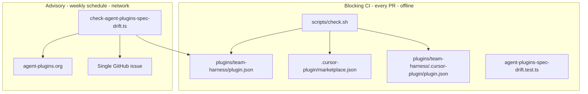

# Agent Plugins spec-drift detection (cursor-team-marketplace)

## Recommended execution authority

| Slice | Authority | Agent instruction |
| --- | --- | --- |
| `plan-review` | Plan-only PR | Do not implement. Stop after opening the plan-only PR. |
| `spec-drift-detection` | Open PR only | Do not merge. Stop after opening the PR. |
| `plan-closure` | Open PR only | Do not merge. Stop after opening the PR. |

Repo default: **Open PR only**.

---

## Toolchain evaluation (TypeScript vs Python)

### Cross-repo constraint (authoritative)

**TypeScript is the default language for new maintained tooling** across `multipliers-dev` repos. Prefer TypeScript unless there is a **stronger technical reason** not to.

The inline Python embedded in [`scripts/check.sh`](scripts/check.sh) is **existing/local structural validation** — it validates JSON, frontmatter, and repo boundaries in one blocking shell gate. It is **not precedent** for choosing the language of a new maintained subsystem (that is an architectural boundary, not a judgment that the Python should be replaced).

This spec-drift feature is a **new subsystem**: pure library + network CLI + offline tests + scheduled workflow integration. It should follow the same TypeScript pattern already shipped in [`renovate-workflow`](https://github.com/multipliers-dev/renovate-workflow) (PRs [#29](https://github.com/multipliers-dev/renovate-workflow/pull/29)–[#32](https://github.com/multipliers-dev/renovate-workflow/pull/32)).

### Option A — Port `renovate-workflow` TypeScript closely

**Adds:** root `package.json`, `package-lock.json`, `vitest.config.ts`, `scripts/tsconfig.json`, `.gitignore` (`node_modules/`), `actions/setup-node` in CI and the advisory workflow, `npm ci` on every PR, Vitest/tsx devDependencies.

**Pros:**

- Matches the **cross-repo default** for new maintained tooling.
- Near line-for-line reuse of merged reference files — lower implementation risk and easier future extraction.
- Proven injectable-deps + Vitest pattern for deterministic offline tests with mocked `fetch`.
- Structural alignment with the first implementation (`renovate-workflow`) — same file boundaries, JSON shape, exit codes, workflow issue logic.
- Root `package.json` here is **dev-tooling only** (private, not npm publish, not plugin surface) — distinct from the Agent Plugins 1.0 migration deferral of a general test harness.

**Cons:**

- Adds Node setup to PR CI and the advisory workflow (acceptable cost for a maintained subsystem).
- Requires PR #32 `npm run --silent` guardrail for workflow JSON capture.
- Two validation layers in one repo: existing inline Python in `check.sh` for local structural validation (unchanged) + TypeScript drift subsystem (new).

### Option B — Python implementation

**Pros:** Avoids root Node tooling; reuses Python already on CI runners.

**Cons (why this is not chosen):**

- **Violates the cross-repo TypeScript default** for new maintained tooling without a stronger technical reason — Python offers convenience, not a capability TypeScript cannot provide.
- Diverges from the proven reference implementation — higher port risk and worse future extraction story.
- Creates a one-off language island for a subsystem that already exists in TypeScript in `renovate-workflow`.

### Is there a stronger technical reason to avoid TypeScript?

**No.**

| Candidate objection | Assessment |
| --- | --- |
| “Repo has no root `package.json`” | Superseded for **new subsystems** by cross-repo policy; minimal private dev manifest is intentional, not a product publish surface. |
| “Agent Plugins 1.0 migration deferred npm harness” | That deferral targeted a general repo test harness, not this scoped maintenance subsystem with a proven TS reference. |
| “Python in `check.sh` means Python for drift” | `check.sh` Python is existing/local structural validation — explicitly not precedent for new subsystems. |
| “Python avoids npm lifecycle JSON pollution” | Real issue, but solved (`npm run --silent`) — not a reason to choose a different language. |
| “Smaller maintenance footprint” | TypeScript maintenance is **shared** across repos via reference reuse; Python would be repo-unique divergence. |

### Decision: **Option A — TypeScript**

Port/adapt the proven `renovate-workflow` implementation. Adapt repo-specific defaults (manifest path, docs location, issue body wording) without mechanical copy.

**Do not extract a shared package yet.** Keep file structure close enough that extraction remains straightforward later.

---

## Verified repository topology

Unlike [`renovate-workflow`](https://github.com/multipliers-dev/renovate-workflow) (single-plugin repo, root `plugin.json`), this Team Marketplace keeps three aligned surfaces:

| Path | Role |
| --- | --- |
| [`.cursor-plugin/marketplace.json`](.cursor-plugin/marketplace.json) | Cursor Team Marketplace catalog (`pluginRoot: "plugins"`) — **no** Agent Plugins `$schema` |
| [`plugins/team-harness/plugin.json`](plugins/team-harness/plugin.json) | Portable Agent Plugins 1.0 package manifest — **declared spec source** (`$schema` → 1.0.0 today) |
| [`plugins/team-harness/.cursor-plugin/plugin.json`](plugins/team-harness/.cursor-plugin/plugin.json) | Cursor overlay (`"skills": "./skills"`) |

Package/release version (`1.11.0`) and Agent Plugins **spec** version (`1.0.0` via `$schema`) are separate concerns.



---

## Verified existing validation path

**Blocking gate:** [`.github/workflows/ci.yml`](.github/workflows/ci.yml) runs `sh scripts/check.sh` only today.

[`scripts/check.sh`](scripts/check.sh) (existing inline Python — local structural validation) enforces offline:

- Closed Agent Plugins 1.0 portable top-level keys
- Exact `$schema`: `https://agent-plugins.org/schemas/1.0.0/plugin.schema.json`
- No `skills` / `agents` on package manifest
- Version alignment across package / marketplace `metadata.version` / overlay
- Overlay `"skills": "./skills"`
- Skill frontmatter, templates, bootstrap script, shell syntax, runtime smoke tests, stale-reference guard

**No network access in `check.sh`.** Drift detection is a **separate TypeScript subsystem** — it does not replace or weaken `check.sh`.

**Reference implementation:** [`renovate-workflow`](https://github.com/multipliers-dev/renovate-workflow) PRs [#29](https://github.com/multipliers-dev/renovate-workflow/pull/29)–[#32](https://github.com/multipliers-dev/renovate-workflow/pull/32).

---

## Policy (non-negotiable)

| Concern | Behavior |
| --- | --- |
| Declared-spec conformance | **Blocking** — existing `scripts/check.sh`; no network |
| Repo `behind` latest published spec | **Advisory** — scheduled workflow opens/updates issue; CLI exits **0** |
| Repo `current` | **Advisory** — close drift issue; CLI exits **0** |
| Repo `ahead` | **Advisory warning** — no issue mutation; CLI exits **0** |
| Upstream signal mismatch / fetch failure | CLI exits **1** — not classified as drift |
| Spec migration | **Manual reviewed work** — never auto-edit manifests or bump `$schema` |
| Normal PR CI | Must **not** fail solely because a newer spec exists; must **not** fetch agent-plugins.org in blocking paths |

**Behavioral contract:**

- `behind` / `current` / `ahead` relationship model; `driftDetected = (relationship === "behind")`
- Dual-signal publication: `specification.md` (`Status: Published` + `Spec Version`) **and** schema HTTP 200 with `$id` resolving to the same version
- Signal disagreement → check error, not drift
- One deduplicated maintainer-assigned advisory issue (`agent-plugins-spec-drift` label)
- No automatic migration
- Deterministic offline Vitest tests (mocked `fetch`)
- Network only in manual drift CLI run and scheduled/workflow_dispatch workflow

---

## Files expected to change

### Slice `plan-review` (this PR only)

- [`.cursor/plans/2026-09-14-agent-plugins-spec-drift.plan.md`](.cursor/plans/2026-09-14-agent-plugins-spec-drift.plan.md) — this plan; mark `plan-review` **completed** only

### Slice `spec-drift-detection`

| File | Purpose |
| --- | --- |
| [`scripts/lib/agent-plugins-spec.ts`](scripts/lib/agent-plugins-spec.ts) | Pure parse/compare/dual-signal helpers (port from reference) |
| [`scripts/check-agent-plugins-spec-drift.ts`](scripts/check-agent-plugins-spec-drift.ts) | Network CLI; default manifest `plugins/team-harness/plugin.json` |
| [`scripts/agent-plugins-spec-drift.test.ts`](scripts/agent-plugins-spec-drift.test.ts) | Offline Vitest coverage (mock `fetch`) |
| [`scripts/tsconfig.json`](scripts/tsconfig.json) | TypeScript config for scripts |
| [`.github/workflows/agent-plugins-spec-drift.yml`](.github/workflows/agent-plugins-spec-drift.yml) | Weekly advisory + `workflow_dispatch` |
| [`package.json`](package.json) | Minimal private dev manifest + scripts (not npm publish) |
| [`package-lock.json`](package-lock.json) | Lockfile for reproducible CI |
| [`vitest.config.ts`](vitest.config.ts) | `scripts/**/*.test.ts` |
| [`.gitignore`](.gitignore) | `node_modules/` |
| [`.github/workflows/ci.yml`](.github/workflows/ci.yml) | Add Node setup + offline `npm ci`, `typecheck`, `test` (no network drift CLI) |
| [`plugins/team-harness/docs/versioning.md`](plugins/team-harness/docs/versioning.md) | Conformance vs drift section |

**Explicitly unchanged:** `plugins/team-harness/plugin.json` `$schema` (stays 1.0.0), skill semantics, marketplace topology, [`scripts/check.sh`](scripts/check.sh) assertions (do not weaken).

---

## Architecture details

### 1. Shared library — `scripts/lib/agent-plugins-spec.ts`

Port from [`renovate-workflow/scripts/lib/agent-plugins-spec.ts`](https://github.com/multipliers-dev/renovate-workflow/blob/main/scripts/lib/agent-plugins-spec.ts).

**Exports:** `AGENT_PLUGINS_SCHEMA_BASE`, `PUBLISHED_SPEC_MD_URL`, `parseDeclaredSpecVersion`, `parsePublishedSpecVersion`, `parsePublishedSchemaDocumentVersion`, `buildPublishedSchemaUrl`, `compareSemver`, `evaluateSpecRelationship`, `confirmPublishedUpstreamVersion`.

**Relationship model:**

```ts
type SpecVersionRelationship = "behind" | "current" | "ahead";
// driftDetected = relationship === "behind"
```

**Dual-signal published confirmation (mandatory):**

1. `https://agent-plugins.org/specification.md` → `Status: Published` + `Spec Version: X.Y.Z`
2. `https://agent-plugins.org/schemas/X.Y.Z/plugin.schema.json` → HTTP **200** and JSON `$id` resolves to same `X.Y.Z`

Signal disagreement → throw (upstream/check error, not drift).

### 2. CLI — `scripts/check-agent-plugins-spec-drift.ts`

Port from reference with repo-specific defaults:

- `--plugin-json` default: `plugins/team-harness/plugin.json` (resolved from repo root)
- `--json` → machine-readable stdout
- Exit **0** for `behind` / `current` / `ahead`
- Exit **1** for malformed local config, fetch/parse failures, non-200 schema, signal mismatch
- Exit **2** for bad CLI args

`package.json` script:

```json
"check:agent-plugins-spec-drift": "tsx scripts/check-agent-plugins-spec-drift.ts"
```

**Do not** wire this script into `scripts/check.sh`, pre-commit, or PR network checks.

Manual run:

```bash
npm run check:agent-plugins-spec-drift -- --json
```

### 3. Tests — `scripts/agent-plugins-spec-drift.test.ts`

Vitest; mock `fetch` in CLI integration tests; library tests use fixture strings.

Mirror reference coverage:

- Declared `$schema` parsing; malformed `$schema`
- Published markdown parsing; not `Published`; missing `Spec Version`
- Schema `$id` parsing
- `compareSemver` / `evaluateSpecRelationship`: `current`, `behind` (minor + major), `ahead`
- `confirmPublishedUpstreamVersion`: agree, mismatch, non-200
- CLI integration: same cases + upstream fetch failure (503)

**No internet** in tests or PR CI.

### 4. Advisory workflow — `.github/workflows/agent-plugins-spec-drift.yml`

Port from reference with repo-specific issue body wording:

```yaml
on:
  schedule:
    - cron: "0 9 * * 1"   # Monday 09:00 UTC
  workflow_dispatch:

permissions:
  contents: read
  issues: write

env:
  AGENT_PLUGINS_DRIFT_ASSIGNEE: mastermichaelt
  AGENT_PLUGINS_DRIFT_LABEL: agent-plugins-spec-drift
```

**Pinned actions** (match reference SHAs):

- `actions/checkout@3d3c42e5aac5ba805825da76410c181273ba90b1` (v7.0.1)
- `actions/setup-node@820762786026740c76f36085b0efc47a31fe5020` (v7.0.0)

**JSON capture guardrail** (PR #32 fix — required):

```bash
set -euo pipefail
# --silent keeps npm lifecycle lines off stdout so drift-result.json stays valid JSON.
npm run --silent check:agent-plugins-spec-drift -- \
  --plugin-json plugins/team-harness/plugin.json \
  --json > drift-result.json
```

Issue body references **`scripts/check.sh`** for blocking conformance (not `npm test` / `validate-plugin-structure`).

**Issue deduplication** (label `agent-plugins-spec-drift`):

| `relationship` | Action |
| --- | --- |
| `behind` + no open issue | Create issue; **assign `mastermichaelt`**; apply label |
| `behind` + issue for same `latestPublishedVersion` | Refresh body only (preserve assignee) |
| `behind` + issue for older version | Update title/body to supersede (preserve assignee) |
| `current` | Close all open drift issues with short comment |
| `ahead` | `::warning::` only — **no** create/update/close |

**Issue title:** `Agent Plugins {latestPublishedVersion} available — review migration`

### 5. PR CI — [`.github/workflows/ci.yml`](.github/workflows/ci.yml)

Add Node setup + offline steps after `scripts/check.sh`:

```yaml
- uses: actions/setup-node@820762786026740c76f36085b0efc47a31fe5020 # v7.0.0
  with:
    node-version: 22
    cache: npm
- run: npm ci
- run: npm run typecheck
- run: npm test
```

Do **not** run `check:agent-plugins-spec-drift` (network) in PR CI.

### 6. Documentation — [`plugins/team-harness/docs/versioning.md`](plugins/team-harness/docs/versioning.md)

Add **Agent Plugins spec version** section:

- Spec version vs package `1.11.0` distinction
- [`plugins/team-harness/plugin.json`](plugins/team-harness/plugin.json) targets spec **1.0.0**
- **Conformance** = offline `scripts/check.sh` on every PR (existing local structural validation — unchanged)
- **Drift** = advisory weekly check + manual `npm run check:agent-plugins-spec-drift -- --json` (TypeScript subsystem)
- `behind` / `current` / `ahead` + dual-signal requirement
- Weekly issue behavior; manual migration only
- Same behavioral contract as [`renovate-workflow`](https://github.com/multipliers-dev/renovate-workflow); root `package.json` is dev-tooling for drift detection only (still not npm publish)

---

## Slice — `spec-drift-detection`

**Authority:** Open PR only.

**Required repositories (multi-repo preflight):**

- `multipliers-dev/cursor-team-marketplace` — implementation target
- `multipliers-dev/renovate-workflow` — reference, read-only (PRs #29–#32)

**Branch topology:** fresh branch from `origin/main`; PR base `main`; diff contains **only** this slice.

**Acceptance criteria:**

- [`scripts/check.sh`](scripts/check.sh) blocking Agent Plugins conformance unchanged and offline
- [`plugins/team-harness/plugin.json`](plugins/team-harness/plugin.json) remains on Agent Plugins **1.0.0** `$schema`
- Drift CLI returns `relationship: "current"` against today's published 1.0.0 (both signals agree)
- CLI exits **0** for `behind` / `current` / `ahead`; exits **1** only for config/upstream errors
- Dual-signal enforcement: markdown-only or schema-only never produces drift
- Weekly workflow: `behind` → issue create/update (assign on create); `current` → close; `ahead` → warning only
- `npm run --silent … -- --json` produces `jq`-parseable output
- `npm test` and `npm run typecheck` pass offline
- Normal PR CI does not run network drift check or depend on agent-plugins.org
- No automatic migration
- Implementation structurally close to `renovate-workflow` reference

**Verification:**

```bash
sh scripts/check.sh
npm ci
npm run typecheck
npm test
npm run check:agent-plugins-spec-drift -- --json
# workflow_dispatch on agent-plugins-spec-drift.yml to validate issue management
```

Mark `spec-drift-detection` **completed** in plan frontmatter in the implementation PR.

---

## Slice — `plan-closure`

**Authority:** Open PR only. **Prerequisite:** `spec-drift-detection` merged.

**Deliverables:**

1. Verify `spec-drift-detection` todo is `completed`
2. Add `# Shipped` closure note with PR links
3. Move plan to [`.cursor/plans/archive/2026-09-14-agent-plugins-spec-drift.plan.md`](.cursor/plans/archive/2026-09-14-agent-plugins-spec-drift.plan.md)
4. Mark `plan-closure` completed; update agent prompt paths to archived location

---

## Agent prompts (copy/paste for Cursor)

### `spec-drift-detection`

```text
@.cursor/plans/2026-09-14-agent-plugins-spec-drift.plan.md

Implement slice spec-drift-detection only. Do not start plan-closure. Do not archive the plan.

Authority: Open PR only — implement and open the PR; do not merge.

Topology: start from latest origin/main; branch represents only this slice; PR base must be main.

Repositories: multipliers-dev/cursor-team-marketplace (implementation), multipliers-dev/renovate-workflow (reference, read-only — PRs #29–#32).

Deliverables (TypeScript — port reference closely, adapt topology):
- scripts/lib/agent-plugins-spec.ts (pure helpers; relationship behind|current|ahead; driftDetected derived)
- scripts/check-agent-plugins-spec-drift.ts (default --plugin-json plugins/team-harness/plugin.json; dual-signal published confirmation including schema $id; exit 0 for behind/current/ahead)
- scripts/agent-plugins-spec-drift.test.ts (offline Vitest with mocked fetch; full coverage per plan)
- scripts/tsconfig.json, vitest.config.ts, package.json, package-lock.json, .gitignore (node_modules)
- .github/workflows/agent-plugins-spec-drift.yml (weekly + workflow_dispatch; SHA-pinned actions; behind→issue w/ mastermichaelt on create, current→close, ahead→warning; npm run --silent for JSON)
- .github/workflows/ci.yml — add offline npm ci/typecheck/test only (NOT network drift CLI)
- plugins/team-harness/docs/versioning.md (conformance vs drift; check.sh vs TypeScript drift subsystem)

Do not:
- migrate beyond Agent Plugins 1.0.0
- weaken scripts/check.sh
- add network checks to check.sh, pre-commit, or PR drift execution
- fail PR CI solely on upstream drift
- auto-edit plugin.json or open migration PRs
- change team-harness skill semantics or marketplace topology

Mark spec-drift-detection completed in plan frontmatter in this PR.

Verification: sh scripts/check.sh; npm ci; npm run typecheck; npm test; npm run check:agent-plugins-spec-drift -- --json
```

### `plan-closure`

```text
@.cursor/plans/archive/2026-09-14-agent-plugins-spec-drift.plan.md

Execute only plan-closure.

Authority: Open PR only — docs-only archive PR; do not merge.

Prerequisites: spec-drift-detection merged and marked completed in frontmatter.

Topology: start from latest origin/main; branch represents only this slice; PR base must be main.

Deliverables: verify slice todos, add # Shipped note with PR links, move plan to .cursor/plans/archive/2026-09-14-agent-plugins-spec-drift.plan.md, mark plan-closure completed, update agent prompt references to archived path.

Verification: confirm spec-drift-detection PR is merged before archiving.
```

---

## Out of scope

- Migrating beyond Agent Plugins 1.0.0
- Migrating `scripts/check.sh` structural validation to TypeScript (not part of this plan; no implied deprecation of existing approach)
- Skill moves / semantic changes
- Cursor marketplace topology changes
- Shared npm package extraction
- Network in `scripts/check.sh` or normal PR drift execution
- Auto-bump `$schema`, auto-open migration PRs
- Bumping `plugins/team-harness/plugin.json` package version solely for this maintenance feature
