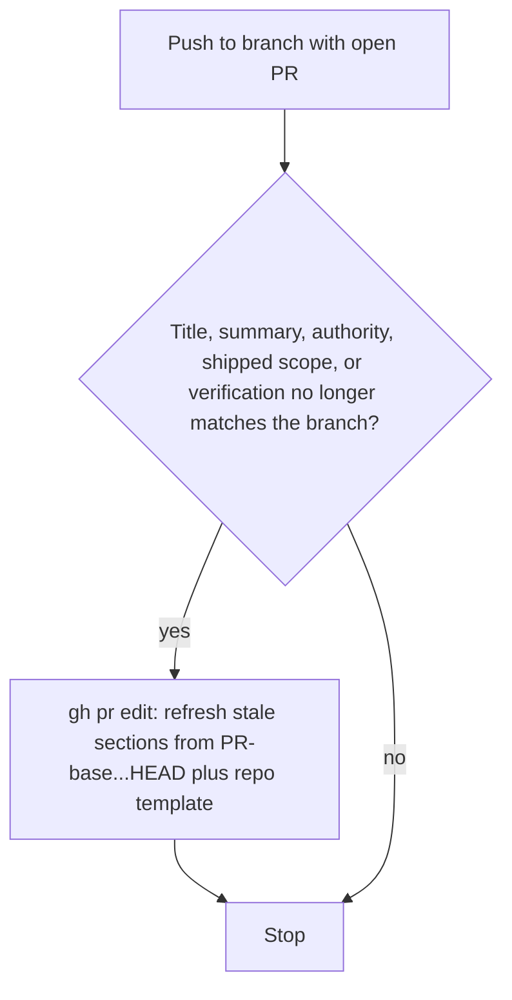

# Keep PR title and description current

## Recommended execution authority

| Slice | Recommended authority | Agent instruction |
| --- | --- | --- |
| plan-review | Plan-only PR | Do not implement. Stop after opening the plan-only PR. |
| keep-pr-metadata | Open PR only | Do not merge. Stop after opening the PR. |
| plan-closure | Open PR only | Do not merge. Stop after opening the PR. |

Repo default: **Open PR only** (see team skill `/planning-methodology`).

## Repository topology

Multi-slice plans stack execution order, not Git branches. Integration branch is `main`.

**Before implementation:** start from latest `origin/main`.

**Before opening the PR:** branch represents only this slice — prior-slice work is on the integration branch, not via branch ancestry.

**After opening the PR:** GitHub PR base is `main`; diff excludes prior-slice work except through merged `main`.

---

## Problem

Yes. The reliable way is an **always-on instruction**, not a GitHub Action or a Cursor hook.

Agents already “automatically” stop after opening a PR because that rule is always in context. Title/description drift happens in **later chats** (review fixes, extra commits) that never hit the create-PR playbook. Those sessions commit and push, then stop. The create-time description stays frozen.

## Why not CI or a hook

- **GitHub Action that rewrites the body** cannot produce the quality you already require (execution authority, what ships in this PR only, test plan, deferred work). It also fights human edits.
- **Cursor hook** (`stop` / `afterShellExecution` after `git push`) can only nudge. It cannot write a good description by itself, and team-harness does not auto-install User hooks.
- **A `/refresh-pr` skill** still requires someone to invoke it — the thing you want to stop doing.

## When the rule applies

This is an instruction the agent evaluates when it pushes — not an event hook.



Load-bearing layer: [docs/engineering-invariants.md](../../docs/engineering-invariants.md) under **PR execution**. Plugin install does **not** update User Rules. After this ships, re-paste that file into Cursor User Rules or the behavior will not be always-on.

Procedure layer: [plugins/team-harness/skills/planning-methodology/SKILL.md](../../plugins/team-harness/skills/planning-methodology/SKILL.md) — expand the current “PR description (when opening from a plan)” section so agents know **how** to refresh, not only **that** they should.

Do **not** copy this into consumer-repo `AGENTS.md` or `merge-safe-prs.mdc`. That would drift.

---

## Slice — plan-review

**Recommended authority:** Plan-only PR

**Rationale:**

- Methodology change should land for review before editing the always-on invariants paste and the portable skill

**Agent instruction:** Do not implement. Stop after opening the plan-only PR.

**Goal:** Commit this plan artifact only.

---

## Slice — keep-pr-metadata

**Recommended authority:** Open PR only

**Rationale:**

- Single merge-safe concern: invariants bullets, skill procedure, and version bump ship together
- No product behavior; User Rules re-paste is an operator step after merge, not a code change

**Agent instruction:** Do not merge. Stop after opening the PR.

**Goal:** Bake keep-current into the always-on paste and the planning-methodology procedure.

### What to add

**Invariant** (short bullets in [`docs/engineering-invariants.md`](../../docs/engineering-invariants.md)):

- After pushing to a branch with an open PR, if the PR’s title, summary, execution authority, shipped scope, or verification no longer matches the branch, refresh the metadata with `gh pr edit` **before stopping**. Do not wait to be asked.
- Rebuild from the current PR `base...HEAD` diff, using `gh pr view` to resolve the base branch, plus the repo PR template when present. Review discussion stays in comments.
- Preserve still-valid human-authored notes and links; refresh only stale sections unless the whole body is structurally obsolete.
- Skip bot-owned PRs (Renovate and similar). Skip when title and body still match the branch.

**Skill procedure** (replace the open-only paragraph in planning-methodology):

- Same callouts as today when **opening** from a plan: authority, PR target (default `main`), slice todo, what ships in **this** PR only, verification, intentional deferrals.
- **Keep-current rule:** after a later push to that PR, `gh pr view` for title, body, and **base branch**; diff `base...HEAD`. If title, summary, execution authority, shipped scope, or verification no longer matches the branch, refresh metadata before stopping.
- Title: update only when the headline is wrong. Body: refresh drifted sections; do not leave an open-time Summary, authority checkbox, todo status, or Test plan that no longer matches.
- Preserve still-valid human-authored notes and links; do not regenerate the body wholesale unless it is structurally obsolete.
- Exclude bot-owned PRs. Planning topology still defaults to targeting `main`; the keep-current diff uses the **actual PR base**, not a hardcoded `origin/main`.

No new skill. No hook. No Action. No change to the `creating-pull-requests` Cursor user rule (create-only; follow-up chats never use it). Optional later: add a one-liner there on this account if create-time wording should mention keep-current.

### Scope and collisions

- Repo: this marketplace only.
- Single implementation concern: invariants + skill section + plugin/marketplace version bump from whatever is on `main` at implement time. `main` is currently **1.7.0** after the repo-bootstrap rename; expect **1.8.0** unless another bump lands first.
- Do not stack on other plan branches. Start from latest `origin/main`.
- Leave archived plans and consumer repos untouched.
- [Unify repo bootstrap](2026-08-28-unify-repo-bootstrap.plan.md) may still be open for closure on `main`; this plan does not edit or archive that file.

### Operator step after merge (required for “automatic”)

Re-paste [docs/engineering-invariants.md](../../docs/engineering-invariants.md) into the Cursor User Rule that currently holds that paste. Until that happens, only chats that invoke `/planning-methodology` will see the new procedure.

### Verification

- Skill still matches planning-methodology layout invariants (no extra frontmatter todos in the template unless we add a keep-current sentence to the existing PR-description guidance only).
- `./scripts/check.sh` green.
- Implementation PR title/body themselves demonstrate the rule (describe keep-current, not only “update skill”).

### Explicit non-goals

- GitHub Actions that rewrite PR bodies
- Cursor hooks (`stop`, `afterShellExecution`)
- A `/refresh-pr` skill
- Consumer-repo `AGENTS.md` / `merge-safe-prs.mdc` copies
- Editing bot-owned PRs

---

## Plan closure (docs-only PR)

**Recommended authority:** Open PR only

**Rationale:**

- Docs-only archival; human review of closure checklist

**Agent instruction:** Do not merge. Stop after opening the PR.

After `keep-pr-metadata` merges:

1. Verify the implementation PR is actually merged to `main`
2. Verify slice todo `keep-pr-metadata` is `completed`
3. Add `# Shipped` closure note with date and PR links
4. Move to `.cursor/plans/archive/2026-08-28-keep-pr-metadata-current.plan.md`
5. Mark `plan-closure` completed; update agent prompt paths

---

## Agent prompts (copy/paste for Cursor)

Use a **fresh Agent-mode chat** per slice.

### plan-review

```text
@.cursor/plans/archive/2026-08-28-keep-pr-metadata-current.plan.md

Execute only plan-review. Do not start implementation slices.

Authority: Plan-only PR — commit the plan artifact only; do not implement. Stop after opening the plan-only PR.

Topology: start from latest origin/main; branch represents only the plan artifact; PR base must be main.

Deliverables: plan file under .cursor/plans/; mark plan-review completed in frontmatter in the same PR.

Verification: plan satisfies planning-methodology envelope; source mermaid and keep-current bullets preserved; no implementation changes included.
```

### keep-pr-metadata

```text
@.cursor/plans/archive/2026-08-28-keep-pr-metadata-current.plan.md

Implement slice keep-pr-metadata only. Prerequisite: plan-review merged. Do not start plan-closure. Do not archive the plan.

Authority: Open PR only — implement and open the PR; do not merge.

Topology: start from latest origin/main; branch represents only this slice; PR base must be main.

Deliverables: add keep-current bullets to docs/engineering-invariants.md; expand the planning-methodology PR description section per this plan (trigger includes authority/status drift; diff is PR base...HEAD via gh pr view; preserve still-valid human notes); bump plugin.json and marketplace.json from whatever is on main. Mark keep-pr-metadata completed in plan frontmatter in this PR.

Verification: ./scripts/check.sh; skill layout invariants unchanged; implementation PR title/body demonstrate keep-current.
```

### plan-closure

```text
@.cursor/plans/archive/2026-08-28-keep-pr-metadata-current.plan.md

Execute only plan-closure.

Authority: Open PR only — docs-only archive PR; do not merge.

Prerequisites: keep-pr-metadata merged and marked completed in frontmatter.

Topology: start from latest origin/main; branch represents only this slice; PR base must be main.

Deliverables: verify slice todos, add # Shipped note, move plan to .cursor/plans/archive/2026-08-28-keep-pr-metadata-current.plan.md, mark plan-closure completed, update agent prompt references to archived path.

Verification: prerequisite implementation PR merged; slice todo completed before archiving.
```

---

# Shipped

**Date:** 28 Aug 2026

**PRs:**

- [Plan review (#27)](https://github.com/multipliers-dev/cursor-team-marketplace/pull/27) — plan artifact committed
- [Implementation (#28)](https://github.com/multipliers-dev/cursor-team-marketplace/pull/28) — keep-current invariants + planning-methodology procedure; plugin/marketplace 1.8.0

**What shipped:**

- Keep-current bullets in [`docs/engineering-invariants.md`](../../docs/engineering-invariants.md)
- Planning-methodology keep-current procedure after follow-up pushes
- Plugin/marketplace 1.8.0

**Deferred work:**

- No GitHub Action rewriter
- No Cursor hooks
- No `/refresh-pr` skill
- No consumer-repo `AGENTS.md` copies
- User Rules re-paste is an operator step after merge
