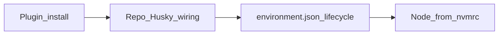

# Cloud-hooks bootstrap (portable primitive)

**Marketplace / plugin install ≠ zero-wiring Cloud-safety.** Installing this plugin distributes the canonical scripts and this recipe. Repositories that use Husky still need a **one-time local wiring** step — and, when Cloud Agents are expected, a committed **`.cursor/environment.json`** lifecycle so Build/install/start actually runs that wiring.

Proven pattern: an existing Cloud Husky bridge + Node-from-`.nvmrc` Build/session PATH recipe; generalized here for new repos.

## Four-layer enforcement model

Do not blur hook infrastructure with formatting ergonomics or CI. Each layer answers a different question:

| Layer | Question | Mechanism | This skill covers |
| --- | --- | --- | --- |
| **1 — Hook availability** | Are Git hooks wired and **runnable in this checkout**? | `prepare-git-hooks.sh`, `verify-git-hooks.sh`, `ensure-hooks.sh`, `husky-shim-repair.sh`, `session-ensure-git-hooks.sh` | **Yes — primary scope** |
| **2a — Agent feedback** | Can agent edits stay formatted while working? | Optional `afterFileEdit` → copied `format.sh` from `format-after-edit.sh` | **Optional copy-only primitive** |
| **2b — Commit correctness** | What must pass before a commit lands locally? | Product `.husky/pre-commit` recipe (lint-staged, lint, typecheck, format:check, …) | **Per-repo — not replaced by this skill** |
| **3 — Authoritative enforcement** | What is the backstop when local/agent machinery fails? | CI (`format:check`, lint, typecheck, …) | **Per-repo CI — not replaced by this skill** |

### Core invariant (Layer 1)

> **An agent must not assume Git hooks are active merely because `core.hooksPath` is configured.**

Configured path ≠ runnable shims. Verification must check **actual executable hook state** in the current checkout/worktree.

- After `git worktree add`: run `npm run prepare` or `npm run verify:git-hooks` in the new worktree before committing.
- **Plugin install ≠ repo wired.** Scripts must be copied and `prepare` / `sessionStart` wired once per repo.

## Wiring model (how Layer 1 gets installed)

| Layer | What it does | Where it lives |
| --- | --- | --- |
| 1. Plugin install | Distributes capability (Husky scripts + Cloud Node scripts + recipes) | Marketplace / plugin install |
| 2. Repo bootstrap | Wires `prepare`, `ensure-hooks`, `sessionStart`, shared `husky-shim-repair.sh` | One-time in-repo copy |
| 3. Cloud lifecycle | Guarantees Cloud **runs** wiring (`install` → Node pin + deps + `prepare`; `start` → session PATH + ensure-hooks rechain) | Committed `.cursor/environment.json` + copied Cloud Node scripts when needed |



**Node pin layering:** portable scripts read `.nvmrc` as a **major pin only**. They do not parse `package.json` `engines.node` semver ranges. If `engines.node` requires a newer major and no `.nvmrc` exists, **you** (the bootstrap agent) decide whether to add a `.nvmrc` pin before wiring Cloud lifecycle — that intelligence does not live in the shell scripts.

**Install command layering:** the dependency install command is repo-specific (lockfile, CI, workspaces, nested installs, pnpm vs npm). Inspect this repo at wire time and write the actual command into repo-local wrapper/config. The portable `cloud-agent-install.sh` requires `CLOUD_AGENT_INSTALL_CMD` or command arguments and fails clearly if absent — it does **not** infer `npm ci`, pnpm, or workspace layout.

## When to use

- A Husky repo silently skips hooks on Cursor Cloud because `CI=true`
- Porting Cloud-safe prepare/ensure from this plugin into an existing or new repo
- Explaining why marketplace / plugin install alone did not fix Cloud commits by itself
- Cloud Agents are expected and the repo needs committed `environment.json` (not deferred to first Cloud use)
- Wiring an **existing** repo manually — for empty directories, use `/repo-bootstrap` instead (ships the same Husky trio + minimal lifecycle in one shot). This skill is for hook/cloud wiring into existing repos only — not a generic non-empty migration path.

## What the plugin ships

Relative to the `team-harness` plugin root:

| Path | Role |
| --- | --- |
| `scripts/prepare-git-hooks.sh` | Cloud-aware prepare: run Husky on Cursor Cloud even when `CI=true`; skip Vercel / GitHub Actions / non-Cloud CI; self-heal missing/non-executable `.husky/_` shims via shared `husky-shim-repair.sh`; order is install/repair → verify → ensure-hooks (ensure-hooks last, always runs even when verify fails; prepare still exits non-zero on bad shims) |
| `scripts/verify-git-hooks.sh` | Fail fast when any repo-defined Git hook under `.husky/<hook>` lacks an executable `.husky/_/<hook>` shim; helpers like `common.sh` are ignored |
| `scripts/husky-shim-repair.sh` | Shared shim detection + husky re-run — single repair definition for prepare and sessionStart |
| `scripts/ensure-hooks.sh` | Point Cloud `agent-hooks` dispatcher at `~/.cursor/husky-bridge`, which resolves the current repo’s `.husky/*` at hook time |
| `scripts/session-ensure-git-hooks.sh` | `sessionStart`: rechain ensure-hooks; verify runnable shims in current checkout; attempt shared shim repair; emit `HOOKS NOT RUNNABLE` warning when still broken (fail-open) |
| `scripts/format-after-edit.sh` | Optional Layer 2a: fail-open Prettier on agent-edited paths; copy to `.cursor/hooks/format.sh` + wire `afterFileEdit` — **agent ergonomics only**, not a Husky or pre-commit substitute |
| `scripts/cloud-agent-session-path.sh` | Prepend `/usr/local/bin` on `PATH` (idempotent); safe to source repeatedly |
| `scripts/cloud-agent-install.sh` | If PATH Node major ≠ `.nvmrc` major, extract the full official Node distribution prefix into `/usr/local`; persist session PATH; run declared dependency command |
| `scripts/cloud-agent-start.sh` | Session PATH + Node probe log + `sh scripts/ensure-hooks.sh` |

## One-time wiring checklist (per Husky repo)

When **Cloud Agents are expected**, complete all applicable steps during bootstrap — not on first Cloud use.

1. Copy (or vendor) the Husky scripts from the installed **team-harness** plugin into the repo — typical layout:
   - `scripts/prepare-git-hooks.sh`
   - `scripts/verify-git-hooks.sh`
   - `scripts/husky-shim-repair.sh`
   - `scripts/ensure-hooks.sh`
   - `.cursor/hooks/ensure-git-hooks.sh` ← from `session-ensure-git-hooks.sh`
2. Point `package.json` `"prepare"` at the Cloud-aware prepare script (replace naive `husky` / `if CI skip` helpers). Optionally add `"verify:git-hooks": "sh scripts/verify-git-hooks.sh"` for manual checks.
3. Ensure `.cursor/hooks.json` includes a `sessionStart` entry that runs `.cursor/hooks/ensure-git-hooks.sh` with `timeout: 15` (fail-open).
4. Keep **per-repo** `.husky/pre-commit` (and friends) contents — lint-staged recipes differ; the plugin does not replace them (**Layer 2b**).
5. **Commit `.cursor/environment.json`** with lifecycle commands for this repo:
   - **Minimal** (Node already matches Cloud VM / no `.nvmrc` pin needed): `"install"` = this repo’s deterministic dependency command (must trigger `prepare`); `"start"` = `sh scripts/ensure-hooks.sh`.
   - **When `.nvmrc` pins a newer Node major** than typical Cloud VMs: also copy `cloud-agent-session-path.sh`, `cloud-agent-install.sh`, and `cloud-agent-start.sh`; set `"install"` / `"start"` to those wrappers; declare the install script’s dependency command from **this repo’s** CI/lockfile (wrapper script, env var, or args — not hardcoded inside the portable script).
   - If `engines.node` implies a newer major but no `.nvmrc` exists, decide whether to add a `.nvmrc` pin as part of bootstrap before wiring Cloud lifecycle.
6. **Optional Layer 2a (agent ergonomics):** copy `format-after-edit.sh` → `.cursor/hooks/format.sh` and add `afterFileEdit` to `hooks.json` (e.g. 30s timeout). This is a **redundant formatting path for agent sessions** — it does **not** replace Husky, pre-commit lint/typecheck/format:check, or CI. Skip for test+typecheck-only repos (e.g. greenfield `/repo-bootstrap`).
7. Verify on Cloud: Build runs `install` → deps + `prepare`; start runs ensure-hooks; a commit triggers the bridge (`[ensure-hooks]` messages) and runs the repo’s Husky hooks.
8. **After `git worktree add`:** run `npm run prepare` (or `npm run verify:git-hooks` after prepare) in the new worktree before committing — worktrees inherit `core.hooksPath=.husky/_` but not executable `.husky/_` shims until prepare runs there.
9. **When re-wiring existing repos:** re-copy `prepare-git-hooks.sh`, `verify-git-hooks.sh`, and `husky-shim-repair.sh` (plus optional `verify:git-hooks` script) from the installed plugin — older in-repo copies may lack worktree shim self-healing, sessionStart verify/repair, or generalized verify.
10. **After merge:** trigger and promote a **new environment Build** so Cloud stops reusing the old snapshot. The plugin cannot automate Build promotion.

## Conceptual `environment.json` shapes

**Optional Layer 2a (`afterFileEdit` + format hook):**

```json
{
  "version": 1,
  "hooks": {
    "sessionStart": [
      {
        "command": "sh .cursor/hooks/ensure-git-hooks.sh",
        "timeout": 15
      }
    ],
    "afterFileEdit": [
      {
        "command": "sh .cursor/hooks/format.sh \"$CURSOR_FILE_PATH\"",
        "timeout": 30
      }
    ]
  }
}
```

Copy `format-after-edit.sh` → `.cursor/hooks/format.sh`. Layer 2a is **agent ergonomics only** — not a substitute for Layer 2b pre-commit or Layer 3 CI.

**Minimal `hooks.json` (Layer 1 only — no afterFileEdit):**

```json
{
  "version": 1,
  "hooks": {
    "sessionStart": [
      {
        "command": "sh .cursor/hooks/ensure-git-hooks.sh",
        "timeout": 15
      }
    ]
  }
}
```

**Minimal `environment.json` (Node already matches VM / no `.nvmrc` pin needed):**

```json
{
  "name": "<repo>",
  "install": "<repo's deterministic dependency install>",
  "start": "sh scripts/ensure-hooks.sh"
}
```

**When `.nvmrc` pins a newer major than the Cloud base image:**

```json
{
  "name": "<repo>",
  "install": "sh scripts/cloud-agent-install.sh",
  "start": "sh scripts/cloud-agent-start.sh"
}
```

Wire the install script’s dependency command at bootstrap time — for example a repo-local wrapper that exports `CLOUD_AGENT_INSTALL_CMD` and execs the portable script, or pass the command via `environment.json` / shell wrapper. Do **not** cargo-cult another product’s install line. Product extras (dev terminals, ports) stay out of this primitive.

## Explicit non-goals

- Do not claim a brand-new Husky repo is Cloud-safe after marketplace / plugin install alone
- Do not overwrite product-specific hook contents from this skill
- Do not add Cursor rules here; invariants live in User Rules (`docs/engineering-invariants.md` from the installed plugin)
- Do not clone cursor-team-marketplace or any other repo to obtain packaged scripts
- Do not copy from a `plugins/team-harness/...` path relative to the target repo — scripts live only in the installed plugin
- Do not add `templates/environment.json` or any copyable JSON template under the plugin
- Do not parse `engines.node` semver ranges inside portable scripts
- Do not infer package manager / workspace layout inside `cloud-agent-install.sh`

## Agent behavior

When asked to wire Cloud hooks into a repo:

1. Locate the installed **team-harness** plugin on disk (Customize → Plugins, or Cursor’s local plugins directory). Copy from that plugin’s `scripts/` (Husky trio + Cloud Node trio when `.nvmrc` requires a newer major). If packaged scripts cannot be found, **stop** and tell the user the plugin is not installed — do not clone cursor-team-marketplace or read another repo.
2. Update `prepare` + `sessionStart`.
3. If Cloud Agents are in scope, commit `environment.json` in the **same** bootstrap PR — do not defer to first Cloud use.
4. Choose the install command from this repo’s lockfile/CI; write it into wrapper config (`CLOUD_AGENT_INSTALL_CMD` or args) at wire time.
5. Open an Open-PR-only change for that repo and state clearly that marketplace / plugin install alone was not sufficient by itself.
6. Remind the human to trigger/promote a new environment Build after merge.

For bootstrapping an **actually empty** directory into a pre-wired repo, use `/repo-bootstrap` — it copies this skill's layer-2 wiring plus minimal layer-3 `environment.json` automatically and stops. Do not chain both skills.
